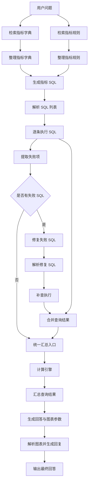

# Dify 智能问数工作流现状

> 历史调查记录：本文记录的“前端直连 Dify、静态名单、尚未接 Gateway”是 2026-08-28 的基线，不代表当前环宝代码链路。当前智能问数 Gateway/v2 协议和未完成的外部发布项以《智能问数一体化升级交付报告》为准。

更新时间：2026-08-28

本文记录当前服务器上实际运行的 Dify 智能问数工作流，以 Dify 自托管实例和数据库中的工作流配置为准。它用于和前端代码、AI Gateway 设计文档交叉核对，避免把计划中的链路误写成已经上线的链路。

## 1. 实例和应用定位

| 项目 | 当前值 |
|---|---|
| Dify 地址 | `http://121.237.178.23:9002` |
| Dify 版本 | `1.16.1` |
| Dify 部署目录 | `/root/dify/dify-main/docker` |
| 应用名称 | `智慧办公—智能问数` |
| 应用 ID | `200bb456-20bf-48ab-af38-c7b9e59ff070` |
| 应用模式 | `advanced-chat` |
| 应用状态 | `normal` |
| API / Site | 已启用 |
| 应用关联的已发布工作流 ID | `f03075f3-9fa8-4a9f-afcc-19d891acb1bf` |

这个应用是当前项目 `data-query` 能力实际调用的 Dify 应用，调用接口仍然是：

```text
POST http://121.237.178.23:9002/v1/chat-messages
response_mode = streaming
```

当前应用有两个需要区分的版本：

| 版本 | 工作流记录 ID | 保存时间 | 节点 / 连线 | 当前是否对外生效 |
|---|---|---:|---:|---|
| 已发布版本 | `f03075f3-9fa8-4a9f-afcc-19d891acb1bf` | 2026-08-28 01:50:36 | 28 / 30 | 是，应用 `workflow_id` 指向它 |
| 最新草稿 | `37b9a2aa-b5d5-4f92-9b4f-a2d2e8ebb170` | 2026-08-28 02:19:38 | 28 / 30 | 否，尚未发布 |

数据库时间以 Dify 服务器记录为准。虽然草稿和已发布版本的节点数、连线数相同，但节点配置内容已经发生变化，所以不能只看数量判断两者一致。要让最新草稿生效，必须在 Dify 控制台完成发布，然后重新验证前端 API 请求。

## 2. 当前真实链路

当前已发布工作流不是 Dify HTTP 节点调用 AI Gateway，而是 Dify 的 `rookie_text2data` 插件直接连接 KingbaseES 执行 SQL：

```text
前端 data-query
    ↓ POST /v1/chat-messages，streaming
Dify 智能问数应用
    ↓ LLM 生成并校验 SELECT / WITH SQL
rookie_text2data / rookie_excute_sql
    ↓ 直接连接 KingbaseES
生产指标库
    ↓
SQL 结果整理、指标计算、回答和图表 JSON
    ↓
Dify streaming 返回前端
```

当前草稿和已发布版本的工作流 JSON 中都没有 `current_user_name`、`userName` 或 `AI_GATEWAY` 字段引用；两版都包含 `DB_HOST`、`DB_PASSWORD` 等 Dify 环境变量引用。因此：

- 前端虽然会传 `inputs.current_user_name`，但当前 Dify 图中没有消费它。
- 当前 Dify 查询不会经过仓库内的 Spring Boot AI Gateway。
- 当前实际数据库访问权限由 Dify 插件连接配置、数据库账号权限和 SQL 白名单共同决定。
- 仓库中的 AI Gateway 查询接口仍属于已实现但尚未接入当前 Dify 工作流的安全中间层。

这是当前最重要的现状差异，后续切换到 Gateway 前不能把现有工作流描述成已经完成了服务端用户鉴权。

## 3. 工作流总览



执行顺序是：先并行检索指标字典和指标规则，再由大模型生成一个或多个 SQL；SQL 解析节点做白名单校验后进入第一轮批量执行。若有失败 SQL，工作流会单独调用修复模型，重新校验后进行补查，最后统一汇总成功结果和仍失败的结果，再进入计算、回答和图表处理。

## 4. 节点明细

下面的节点 ID 来自最新草稿。Dify 已发布版本使用同一组业务节点 ID，但配置内容和草稿存在差异。

### 4.1 输入、检索和 SQL 生成

| 节点 ID | 类型 / 名称 | 输入 | 输出 | 当前职责和关键配置 |
|---|---|---|---|---|
| `1780919457192` | start / 用户问题 | `sys.query` | 系统查询上下文 | 接收用户自然语言问题。当前 start 节点没有额外表单变量。 |
| `1787827566589` | knowledge-retrieval / 检索指标字典 | `sys.query` | `result` | 检索数据集“智能问数-指标字典”；`top_k=4`、multiple 检索，配置了 reranker 名称但 `reranking_enable=false`。 |
| `1781000000014` | code / 整理指标字典 | 检索结果 | `result`、`count` | 兼容不同检索结果包装，去重并限制候选指标数量，输出编码、名称、单位等紧凑文本。 |
| `1787827877222` | knowledge-retrieval / 检索指标规则 | `sys.query` | `result` | 检索数据集“智能问数-指标规则”；`top_k=4`、multiple 检索，reranking 当前关闭。 |
| `1781000000016` | code / 整理指标规则 | 检索结果 | `result`、`count`、`cutoff` | 抽取公式、参数依赖、数据截止日期，去重后注入 SQL 生成和最终回答。 |
| `llm` | llm / 生成指标 SQL | 用户问题、指标字典、指标规则、截止日期 | `text` | 使用 `Qwen3.8-27B`。要求只输出严格 JSON 数组，每项只有 `title` 和 `sql`；只允许安全的 SELECT / WITH，不生成写操作、DDL、多语句或数据库连接信息。 |
| `1780921133248` | code / 解析 SQL 列表 | `llm.text` | `result`、`count`、`first_title`、`first_sql` | 解析模型 JSON，复用 SQL 安全校验。拒绝非 SELECT / WITH、危险关键字、未授权 schema 或表名，并给后续迭代器标准化输入。 |

两个知识库当前 ID 为：

| 数据集 | ID | 用途 |
|---|---|---|
| 智能问数-指标字典 | `b7beaa45-ce57-4429-95ca-7c7f913a72ec` | 生产运行指标的正式名称、编码和单位。 |
| 智能问数-指标规则 | `ef4a18f0-6b92-41df-a2c1-c5e85430eec7` | 计算公式、参数依赖、单位和数据截止日期。 |

### 4.2 第一轮 SQL 执行

| 节点 ID | 类型 / 名称 | 输入 / 输出 | 当前职责和关键配置 |
|---|---|---|---|
| `1780921817315` | iteration / 逐条执行 SQL | 输入 `1780921133248.result`；输出 `1780999999001.result` | 第一轮 SQL 批量执行；`is_parallel=true`、并发数 `5`、`continue-on-error`、展开输出。 |
| `1780921817315start` | iteration-start | 迭代当前项 | Dify 迭代器内部技术节点，不承载业务逻辑。 |
| `1780921883266` | code / 组装 SQL 参数 | 当前迭代项 | 输出当前项的 `title` 和 `sql`，供 SQL 工具节点读取。 |
| `1784715296667` | tool / 执行 SQL 查询 | 组装后的 title/sql | 使用 `jaguarliuu/rookie_text2data` 插件的 `rookie_excute_sql`；数据库类型固定为 `kingbase`，结果格式为 JSON，首轮端口当前固定为 `54321`，其余连接信息从 Dify 环境变量引用。失败走 `fail-branch`，工具配置启用最多 3 次重试、间隔 1000ms。 |
| `1780999999001` | code / 整理查询结果 | 工具 JSON、`error_message`、title、sql | 统一包装为 `{ok,title,sql,error,data}`，兼容 Kingbase Oracle 兼容模式下的空字符串判断。 |

首轮 SQL 工具使用的变量引用包括 `DB_NAME`、`DB_HOST`、`DB_SCHEMA`、`DB_USER`、`DB_PASSWORD`；这些值不写入仓库文档和代码。

### 4.3 失败 SQL 修复和补查

| 节点 ID | 类型 / 名称 | 输入 / 输出 | 当前职责和关键配置 |
|---|---|---|---|
| `1781000000001` | code / 提取失败项 | 第一轮迭代输出 | 输出全量 `all_items`、失败数量 `failed_count` 和供模型读取的 `failed_items` 字符串。 |
| `1781000000010` | if-else / 是否有失败 SQL | `failed_count` | 条件为 `failed_count > 0`；true 进入修复链路，false 直接进入统一汇总。 |
| `1781000000002` | llm / 修复失败 SQL | 用户问题、失败项 | 使用 `Qwen3.8-27B`。只修复语法、字段、别名或类型问题；只输出严格 JSON，不新增未提供的表，只允许 SELECT / WITH。 |
| `1781000000003` | code / 解析修复 SQL | 修复模型 `text` | 解析 `queries` JSON 并复用首轮 SQL 白名单校验，输出标准化 SQL 数组和数量。 |
| `1781000000004` | iteration / 补查执行 | `1781000000003.result`；输出 `1781000000007.result` | 第二轮补查；`is_parallel=false`，串行执行，迭代上限为 `10`，`remove-abnormal-output`，展开输出。 |
| `1781000000004start` | iteration-start | 迭代当前项 | Dify 迭代器内部技术节点，不承载业务逻辑。 |
| `1781000000005` | code / 组装补查参数 | 当前迭代项 | 输出修复后的 `title` 和 `sql`。 |
| `1781000000006` | tool / 执行补查 SQL | 修复后的 title/sql | 使用同一个 `rookie_excute_sql` 插件；数据库类型为 `kingbase`，端口从 `DB_PORT` 环境变量读取，结果为 JSON，失败走 `fail-branch`。 |
| `1781000000007` | code / 整理补查结果 | 工具 JSON、错误信息、title、sql | 与首轮结果整理逻辑一致，包装补查结果。 |
| `1781000000008` | code / 合并查询结果 | 首轮输出、补查输出 | 首轮成功项和补查结果合并；补查后仍失败的项保留最新错误；输出 `result`、`ok_count`、`fail_count`、`failed_notes`。 |
| `1781000000012` | code / 统一汇总入口 | 首轮全量项、修复后结果 | 有补查结果时优先使用补查结果，否则使用首轮全量结果，保证两条分支都能进入后续节点。 |

这里有一个需要持续关注的配置差异：首轮 SQL 工具的端口是常量 `54321`，补查 SQL 工具的端口来自 `DB_PORT`。如果 Dify 环境变量不是 `54321`，两轮查询可能连接到不同端口，发布前应在 Dify 节点测试中确认。

### 4.4 计算、回答和图表输出

| 节点 ID | 类型 / 名称 | 输入 / 输出 | 当前职责和关键配置 |
|---|---|---|---|
| `1781000000017` | code / 计算引擎 | 汇总 items、指标规则、用户问题 | 根据规则识别计算指标，展开基础指标和公式，替换设备参数或源指标，安全求值；输出 `has_calc`、`calc_target`、`calc_value`、`calc_formula`、`calc_params`、`calc_detail` 和透传 items。 |
| `1780922361536` | code / 汇总查询结果 | 计算引擎 items | 清理空值、SQL、query 等不应直接交给回答模型的内容，只保留结果摘要，输出 `result` 文本。 |
| `1780922485769` | llm / 生成回答与图表参数 | 用户问题、结果摘要、规则截止日期、计算引擎详情 | 使用 `Qwen3-32B-Int4`。只能依据查询结果回答，不展示 SQL、连接信息和推理过程；输出严格 JSON，固定包含 `results`、`ECharts`、`chartType`、`chartTitle`、`chartData`、`chartXAxis`。趋势或分类结果才生成图表，单值不生成 gauge。 |
| `1780923024622` | code / 解析图表并生成回复 | 回答模型 `text` | 移除 `<think>`，提取并校验最终 JSON，整理回答文本和图表字段；输出 `text`、`results`、`ECharts`、`chartType`、`chartTitle`、`chartData`、`chartXAxis`。 |
| `final_answer` | answer / 输出最终回答 | `1780923024622.text` | 将解析后的最终文本作为 Dify 工作流答案返回前端。 |

## 5. SQL 安全和数据口径

### 5.1 模型生成约束

当前 SQL 生成系统提示固定了以下口径：

- KingbaseES 为 PostgreSQL 兼容数据库。
- 业务表 schema 为 `MSOKFPT`。
- 指标快照表按半年保存，表名形如 `CGXTAPPMISDate_YYYY_MM`；查询年份或月份时需要组合 `_06` 和 `_12` 快照后再过滤日期。
- 日期字段为 `ZBRQ`，指标值字段为 `newIndicator`，原始值字段 `ZBZ` 为 varchar，聚合前需要转为数值。
- 组织过滤优先使用 `orgcode`，并关联 `MSOKFPT.BFAdminOrganization` 的 `Code` 和中文名称。
- 设备参数从 `MSOKFPT.enterprise_equipment_info` 获取。
- 计算指标按检索到的规则展开，禁止猜指标名称、编码和公式。

### 5.2 代码校验层

`解析SQL列表` 和 `解析修复SQL` 两个代码节点都会做二次安全校验，当前允许的表范围是：

- `CGXTAPPMISDate_YYYY_MM` 格式的半年快照表。
- `CGXTAPPMISNewIndicator`。
- `BFAdminOrganization`。
- `enterprise_equipment_info`。

两处校验都会拒绝 INSERT、UPDATE、DELETE、DROP、TRUNCATE、ALTER、CREATE、GRANT、REVOKE、COPY 等危险操作。这个校验是工作流内部的防线，但不能替代数据库账号的最小权限、网络隔离和服务端身份鉴权。

## 6. 当前项目侧对接状态

前端 `src/services/chatApi.js` 当前直接调用 Dify 的 `/chat-messages`，使用 `VITE_DATA_QUERY_DIFY_API_BASE` 和 `VITE_DATA_QUERY_DIFY_API_KEY`，以 streaming 方式读取答案。进入智能问数前，`src/config/dataQueryAccess.js` 使用姓名做前端静态名单检查；`VITE_AI_GATEWAY_BASE_URL` 目前只被人员管理 CRUD 使用。前端会把当前用户姓名放进 `inputs.current_user_name`，但当前 Dify 工作流没有引用这个变量，所以它目前不会影响 SQL 工具权限。

仓库内 `ai-gateway/` 已实现智能问数开放范围检查、查询前二次校验和人员管理接口，但当前 Dify 工作流中没有 HTTP 节点调用它。后续如果切换到 Gateway，需要同时完成：

1. Dify SQL 执行节点改为 HTTP 节点，禁止 Dify 直接持有数据库连接参数。
2. 将可信用户身份放进 Gateway 能验证的服务端上下文，不能只相信前端 `inputs`。
3. 重新验证 SQL 白名单、固定 queryCode、数据库最小权限和超时限制。
4. 在已发布工作流和前端 streaming 链路上做回归测试。

## 7. 发布前核对清单

- [ ] 确认修改的是 `智慧办公—智能问数`，不是 `01-数据库查询助手` 或历史测试应用。
- [ ] 确认最新草稿已经发布，应用的 `workflow_id` 已指向新的已发布记录。
- [ ] 检查两处 SQL 工具的数据库地址、端口、schema 和账号引用一致。
- [ ] 用普通指标、时间序列指标、分类排名和计算指标各测试一次。
- [ ] 制造一条可控失败 SQL，验证修复分支、补查分支和最终汇总行为。
- [ ] 验证回答不输出 SQL、连接信息或 `<think>`。
- [ ] 验证图表 JSON 能被前端 `DataQueryChart.vue` 正常消费。
- [ ] 如果切换 Gateway，确认工作流中不再存在直接 Kingbase SQL 工具节点，并重新验证用户权限。
