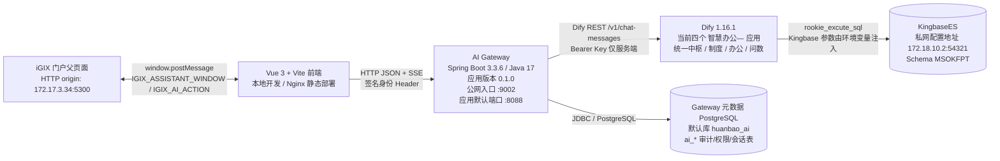

# 环宝 AI 智能问数与副驾系统现状全景审计报告

审计日期：2026-09-02（Asia/Shanghai）
审计范围：本地 Vue/Vite 前端、同工作区 Spring Boot AI Gateway、线上 Gateway 只读端点、Dify 控制台全部应用及以 `智慧办公—` 开头的当前应用、仓库内数据库 DDL/交接文档。
审计目标：对齐架构设计、代码实现、线上入口、Dify 草稿和数据库语义资产之间的实际状态。

## 0. 执行摘要

结论先说：当前系统的真实 Dify 口径不是历史上的 `01-数据库查询助手`，而是四个已列入控制台/已安装的 `智慧办公—` 应用。其中 `智慧办公—环宝统一中枢` 已经具备 29 节点、40 条连线的统一编排，问数分支存在 v2 结构化输出和 `auth_context_json` 权限上下文消费逻辑；`智慧办公—智能问数` 是独立的 10 节点、15 连线问数工作流；`智慧办公—环宝制度智能助手` 是独立知识库工作流；`智慧办公—环宝办公智能助手` 是 Agent Chat。`01-数据库查询助手` 应作为第一版历史基线，不能再作为当前生产工作流代表。

当前最重要的三个事实是：

1. 本地前端运行时已经不再直连 Dify，制度问答、办公智能、智能问数都走 `VITE_AI_GATEWAY_BASE_URL`。本地构建成功，问数前端已有结构化结果卡片和 ECharts 动态图表。
2. 线上 `http://121.237.178.23:9002/api/ai/health` 返回 Gateway `0.1.0 / UP`。未携带签名身份访问智能问数权限接口返回 `401`，说明生产入口的身份闸门确实在工作；动作审计查询接口返回 `200`，当前返回总记录数为 0。
3. 当前统一中枢草稿实测为 29 个节点、40 条连线，数据库查询分支有确定性计划、组织/指标解析、权限范围过滤、异常统计和 v2 结果协议；但它仍由 Dify 的 `rookie_excute_sql` 插件直接连接 KingbaseES。Gateway 环境变量实际绑定的是哪个 Dify App/发布版本，仓库中没有 App ID 配置，本次也没有执行有效问数，故仍需服务器侧只读确认。另有一个高风险细节：工具节点的 schema 参数写成 `public`，而 SQL 使用 `MSOKFPT`，必须验证插件对两者的实际解释。

本次没有执行任何数据库 SQL，没有执行任何 DDL/DML，没有调用用户权限管理的写接口，没有改动现有业务代码；只更新本报告文件。由于 SSH 登录和直连 KingbaseES 均未能建立，数据库表结构、字段注释、`LIMIT 3` 样本、参数库覆盖公司数，本次只能标注为待实库核验，不能把 Prompt 或工作流代码当作数据库事实。

## 1. 审计证据等级与边界

| 等级 | 证据来源 | 本报告如何使用 |
|---|---|---|
| A | 2026-09-02 对线上 Gateway 的只读 HTTP 探测；Dify 控制台当前草稿只读 GET | 作为当前部署/当前草稿事实 |
| B | 工作区源代码、配置、测试、构建产物 | 作为实现事实 |
| C | README、交接文档、SQL DDL、升级交付文档 | 作为设计合同或历史记录，遇到 A/B 冲突时不覆盖当前事实 |
| D | Dify 节点 Prompt 中写死的表名、字段名、公式口径 | 作为当前工作流的语义输入，不等于数据库真实存在或数据质量已验证 |

### 1.1 本次安全执行情况

- 本地只读：读取源码、配置、文档，执行 `npm run build` 和 `mvn test`。
- 线上只读：GET 健康状态、GET 动作审计列表、GET 未授权用户列表；POST 仅发送了空查询/空身份以验证参数与身份拦截，未进入有效 Dify/数据库查询。
- 数据库：未建立直接 SSH/KingbaseES 会话，没有手工发送任何 SQL，也没有执行任何写操作；线上动作审计 GET 属于只读 API，可能由 Gateway 在元数据库内部执行 SELECT，返回 total=0。
- 敏感信息：数据库密码、Dify API Key、Gateway 密钥在本报告中全部使用 `****`、`${ENV}` 或“不展示”处理。
- 工作区：审计时工作区已有未提交修改和未跟踪文件；本次未对现有业务文件做编辑、回退或清理，只更新本报告。

## 2. 系统资产拓扑图



### 2.1 资产版本与部署位置

| 资产 | 当前版本/标识 | 通信协议 | 部署/配置位置 | 事实等级 |
|---|---|---|---|---|
| 前端 | Vue `^3.5.34`、Vite 实际构建 `8.0.16`、ECharts `^6.1.0` | 浏览器 HTTP JSON、SSE、`window.postMessage` | 本地工作区；交接文档记录线上为门户静态/Nginx；`.env.local` 指向 `http://121.237.178.23:9002` | B |
| Gateway | Spring Boot `3.3.6`、Java `17`、项目版本 `0.1.0` | HTTP JSON、SSE、HMAC-SHA256 签名 Header、JDBC | 源码目录 `ai-gateway/`；线上公开入口为 `:9002`，源码默认监听 `:8088` | A/B |
| Dify | 实测版本 `1.16.1`；控制台应用清单共 10 个，其中 4 个名称以 `智慧办公—` 开头且均有已安装记录 | Gateway 到 Dify 为 `/v1/chat-messages`，流式 SSE；Dify 控制台为 HTTP | `http://121.237.178.23:9002/`；当前应用详情按 App ID 区分 | A |
| Dify 统一编排 | `智慧办公—环宝统一中枢` App `8135ce3d-d508-45da-be98-d20a0ec743bb`；草稿 `9da157ac-7091-4cde-a4a6-55d0f8dc90c4`；29 节点/40 连线 | Dify workflow streaming | 当前问数/制度/流程/办公/复合协同的统一中枢候选；草稿更新时间 2026-09-02 12:21:58 | A |
| Dify 制度工作流 | `智慧办公—环宝制度智能助手` App `d9cff882-0120-4e7a-98ad-58ede0ac36cb`；草稿 `8e10225c-040d-4a46-94b0-6ec07f394e68`；5 节点/4 连线 | Dify blocking workflow | 独立知识库问答；草稿更新时间 2026-09-01 23:50:00 | A |
| Dify 办公助手 | `智慧办公—环宝办公智能助手` App `f4efac1a-8bd2-4ba1-8f72-c0e01983dc62`；`agent-chat`，无 workflow | Dify Agent Chat / SSE | 独立办公 Agent；详情显示 function_call、最多 10 轮迭代及内置时间/网页抓取工具 | A |
| Dify 智能问数 | `智慧办公—智能问数` App `200bb456-20bf-48ab-af38-c7b9e59ff070`；发布 workflow `c4e33368-2d51-4d09-99cc-c2396b93411d`；10 节点/15 连线 | Dify workflow streaming | 已安装且置顶；详情、草稿、发布图均可读，当前独立问数主链已完成节点级盘点 | A |
| Dify 历史基线 | `01-数据库查询助手` App `e4a84ffa-e52b-4db6-9052-e352a48cf6c9`；28 节点/29 连线 | 历史 Dify workflow | 第一版问数，不作为当前生产口径；详见第 7 节 | A |
| KingbaseES | KingbaseES，兼容 PostgreSQL；Dify 环境显示端口 `54321` | Dify Kingbase 插件直连 | 目标 Dify 草稿环境配置为私网 `172.18.10.2:54321`，数据库/schema 均为 `MSOKFPT`；密码不记录 | A/D |
| Gateway 元数据数据库 | 源码默认 PostgreSQL；Kingbase 驱动只在 Maven `kingbase` profile 可选 | JDBC | `application.yml` 默认 `jdbc:postgresql://localhost:5432/huanbao_ai`；线上实际连接串未取得 | B |
| iGIX 父页面 | 业务门户版本未在本工作区固定 | `postMessage`，目标 Origin 由配置/referrer 解析 | 前端默认 Origin `http://172.17.3.34:5300` | B |

### 2.2 线上探测结果

| 探测 | 结果 | 判断 |
|---|---|---|
| `GET /api/ai/health` on `121.237.178.23:9002` | HTTP 200；`success=true`；`status=UP`；`version=0.1.0` | Gateway 线上入口可达 |
| `GET /api/ai/action-audits?page=1&size=3` | HTTP 200；`total=0`；`records=[]` | 动作审计 Controller/查询路径可达；当前没有可见动作审计记录 |
| `GET /api/ai/data-query/users` 未带管理员令牌 | HTTP 401；`UNAUTHORIZED` | 用户权限管理接口的管理员令牌闸门生效 |
| `POST /api/ai/data-query/access` 空身份 | HTTP 401 | 生产问数身份校验闸门生效；未执行有效授权查询 |
| `POST /api/ai/data-query/chat` 空 query | HTTP 400 | 请求校验生效；未进入有效 Dify/Kingbase 查询 |
| `121.237.178.23:8088`、`:8090` 直接探测 | 外部不可按预期访问；`:8090` 某路径返回前端 HTML | 当前公开应用入口应以 `:9002` 反向代理为准，内部端口映射仍需服务器侧确认 |

## 3. 本地前端现状

### 3.1 模式、配置和调用链

`src/config/assistantModes.js` 当前有四个模式：制度问答 `policy`、办公智能 `office-ai`、流程助手 `workflow`、智能问数 `data-query`。`src/config/starters.config.ts` 确实存在，虽然项目主体使用 JavaScript，它以 TypeScript 配置文件形式维护启动问题，覆盖制度、问数、流程、办公和组合场景。

| 模式 | 前端配置 | 当前调用 | 备注 |
|---|---|---|---|
| 制度问答 | `apiMode: dify` | Gateway `/api/ai/policy/chat`，blocking JSON | 源码运行链路已不是浏览器直连 Dify |
| 办公智能 | `apiMode: dify` | Gateway `/api/ai/office/chat`，SSE | 支持流式输出；前端过滤/处理流式事件 |
| 流程助手 | `apiMode: mock` | 前端 Mock + 动作卡片 | 不接真实业务系统，不调用 Dify |
| 智能问数 | `apiMode: workflow` | Gateway `/api/ai/data-query/chat`，SSE | Gateway 负责身份、权限、会话和 Dify 代理 |

`src/services/chatApi.js` 是总路由：问数走 `streamDataQueryMessage`，制度走 `sendGatewayPolicyMessage`，办公走 `streamGatewayOfficeMessage`，流程走本地 Mock。运行时没有发现 `VITE_POLICY_DIFY_*` 或 `VITE_OFFICE_DIFY_*` 直连代码；`.env.local` 只有非敏感的 Gateway 地址和默认查询周期。Dify API Key 由后端环境变量读取，不进浏览器构建产物。

### 3.2 智能问数 UI 与协议能力

当前不是纯 Markdown 气泡，已经存在结构化渲染链：

- `src/components/DataQueryResult.vue`：识别 `protocolVersion=2.0` 和 `protocolValid=true`，渲染分析类型、摘要、KPI、表格、洞察、证据/告警、数据来源信息、后续追问、澄清卡片。
- `src/components/DataQueryChart.vue`：基于 ECharts 6，支持柱状、折线、面积、饼/环形、漏斗、雷达、仪表、散点、热力等适配，带复制、CSV、最大化/全屏等操作。
- `src/components/AssistantExecution.vue`：存在业务状态胶囊，状态包括等待、运行、成功、失败、停止、暂停，并能展示当前能力和阶段。
- `src/utils/dataQueryProtocol.js`：协议分析类型已经预留 `FACT`、`DETAIL`、`TREND`、`RANKING`、`COMPARISON`、`RANKING_COMPARISON`、`DISTRIBUTION`、`ANOMALY`、`DRILLDOWN`、`OVERVIEW`。
- `src/services/dataQueryApi.js`：解析 `analysis_started`、`text_delta`、`analysis_result`、`clarification`、`dify_event`、`completed`、`error`，兼容旧式 `message`/`agent_message`/`text_chunk`，同时支持分析状态、图表和 follow-up。

前端能力已经能承接当前问数工作流的 v2 输出；历史 01 的旧输出格式只是对照项。能否稳定显示结构化卡片，取决于线上 Gateway 实际绑定的 Dify 应用是否是当前发布版并输出 v2 协议，而不是取决于前端组件是否存在。

### 3.3 本地题库/语义目录现状

`src/config/dataQueryCatalog.js` 存在本地指标、别名、大区、公司和分析方式目录，包含生产量、发电量、环保、效率、燃料等指标组，并预置月度、同比、区域对比、公司排名等能力开关。它适合做 UI 联想和意图识别，不应被视为权威语义层，原因是：

- 公司、区域、指标名称是前端静态维护，未发现从 Gateway/数据库动态同步的接口。
- 目录里的简称、区域和指标别名没有和 KingbaseES 实际组织/指标表做本次实库匹配。
- 目录可以帮助用户选词，但不能承担服务端数据权限和 SQL 安全边界。

`src/utils/intentRouter.js` 是关键词路由，不是模型意图识别。流程动作优先，其次办公材料，再其次问数和制度；问数通常要求指标词加查询/时间词。当前问数模块会继承上下文处理“那上个月呢”“详细一点”等追问，这对连续对话有帮助，但关键词规则仍可能遇到跨域歧义。

### 3.4 iGIX 通信与防重复现状

`src/utils/actionBridge.js` 的当前实现不是 `targetOrigin='*'`：

- 优先读取显式 Origin 或 `VITE_IGIX_PORTAL_ORIGIN`。
- 没有配置时使用 `document.referrer` 的 Origin。
- 再没有 referrer 时回退到 `http://172.17.3.34:5300`。
- `sendIgixAction()` 每次发送都丢弃调用方传入的 `actionId`，重新生成 UUID，并通过 `window.parent.postMessage()` 发送。

因此，当前有 actionId 唯一标识，但它主要是给父页面做幂等/审计使用；前端本身没有看到基于 actionId 的已发送集合、锁或重复提交抑制。`src/utils/igixAssistantWindow.js` 对入站消息同时校验 `event.source === window.parent` 和 `event.origin === parentOrigin`，窗口控制链路比旧交接文档中的 `*` 描述更收敛。

另一个实际差距是，当前前端调用 `sendIgixAction()` 的地方没有发现对 Gateway `/api/ai/action-audits` 或 `/api/ai/workflow/actions/validate` 的调用。动作审计和动作校验代码在后端存在，但现有前端动作桥没有形成“发送前校验、发送后回执、失败审计”的闭环。

### 3.5 构建验证

`npm run build` 成功：

- Vite `8.0.16`，共转换 2474 个模块。
- 产物包含主 JS 约 367.49 kB、问数结果 chunk 约 715.48 kB，后者 gzip 约 237.97 kB。
- 只有 chunk 大小警告，没有发现类型检查报错或依赖缺失。
- 项目是 JavaScript/Vite 构建，没有独立 TypeScript 类型检查脚本，因此不能把“构建成功”解释成完整类型安全验证。

当前主要工程性提醒是问数 chunk 超过 500 kB，短期不阻断功能，长期可考虑按问数页面/图表能力继续拆分。

## 4. Gateway 服务端现状

### 4.1 路由资产

| 路由 | 方法 | 协议/作用 | 当前判断 |
|---|---|---|---|
| `/api/ai/health` | GET | JSON 健康检查 | 线上已验证，UP / 0.1.0 |
| `/api/ai/data-query/access` | POST | JSON，签名身份 + 权限覆盖检查 | 线上未带签名时 401 |
| `/api/ai/data-query/chat` | POST | `text/event-stream`，问数工作流代理 | 源码已实现；未使用有效身份调用 |
| `/api/ai/data-query/users` | GET/POST/PUT/DELETE | 管理问数用户和 DataScope | 源码要求 `X-Admin-Token`；本次只读 GET 未授权验证为 401 |
| `/api/ai/action-audits` | GET/POST | 动作审计查询/写入 | 线上 GET 可达且当前 total=0；Controller 源码未见用户/管理员权限校验 |
| `/api/ai/workflow/actions/validate` | POST | 校验 `open_form` / `open_menu` 动作 | 只校验动作类型、状态、formCode/funcId，未见真实门户权限调用 |
| `/api/ai/policy/chat` | POST | Dify blocking 代理 | 前端已接入 |
| `/api/ai/office/chat` | POST | Dify streaming 代理 | 前端已接入 |
| `/api/ai/master/chat` | POST | Master streaming 代理 | 当前工作区存在服务端实现和前端调用 |

### 4.2 身份、权限与上下文传递

生产默认配置是 `SIGNED_HEADER`：

1. 前端从 iGIX 获取用户身份。
2. 只有在 `X-Portal-Identity`、时间戳、签名三项都存在时，前端才发送身份 Header。
3. Gateway 用配置中的 `${DATA_QUERY_IDENTITY_SECRET}` 对 `timestamp.signedIdentity` 做 HMAC-SHA256，并进行时间窗口和常量时间比较。
4. 解码后的身份至少要求 `userId` 和 `userName`。
5. `DataQueryAccessService` 按 `tenantId + userId` 查询启用的 `ai_data_query_user` 映射，返回 `scopeType`、`allowedOrgCodes`、`allowedIndicatorCodes`、`allowGroupRanking`、`allowAllOrganizations`。
6. Gateway 将这些字段作为 `auth_*` 输入传给 Dify，并用 Gateway 自己生成的 requestId、opaque conversation handle 和 Dify 内部用户标识控制请求归属。

实现层面已经有权限上下文。重新核对当前 `智慧办公—智能问数` 和 `智慧办公—环宝统一中枢` 后，两个当前问数入口的 start 节点都声明了 `auth_context_json`，计划节点接收授权 JSON，事实解析 Code 也实际读取 `allowed_org_codes`、`allowed_indicator_codes`、`allow_group_ranking`、`allow_all_organizations` 并生成组织过滤。这个结论不适用于历史 `01-数据库查询助手`：01 的节点图没有这些变量，不能用旧版本反推当前版本。即便如此，Gateway 入口鉴权和 Dify SQL 内部过滤仍应保留双层校验，不能只依赖输入变量名出现。

`BODY_TRIAL` 是显式配置才能启用的兼容模式，当前源码默认关闭，符合生产安全方向。源码还实现了每用户每分钟请求数限制、每用户并发限制以及会话所有权锁。

### 4.3 Dify 代理、会话和审计

`DifyDataQueryChatService` 具备以下实现：

- 服务端调用 Dify `/chat-messages`，Bearer Key 不暴露给浏览器。
- 向 Dify 传递已验证身份、授权范围、分析状态、澄清选择等输入。
- 对 Dify SSE 做事件归一化，向浏览器转发 `analysis_started`、`text_delta`、`analysis_result`、`clarification`、`completed`、`error`。
- 每 10 秒发送 SSE heartbeat，防止反向代理误判长耗时流程断开。
- 服务端校验最终答案是否是严格 v2 协议，不符合时返回 `PROTOCOL_VALIDATION_FAILED`。
- 成功和失败都会调用 `DataQueryAuditService` 记录请求、用户、组织、分析类型、指标、时间范围、状态、耗时、Dify request/workflow 标识等；审计写失败不会让问数请求直接失败。

会话映射表代码已经存在，Gateway 对浏览器只暴露 `hb_...` 类型的句柄，Dify conversation id 保留在服务端。但会话映射表和问数审计表的线上实际建表状态、记录数量，本次没有直连元数据库核验。

### 4.4 审计与管控实现完备度

| 能力 | 代码/DDL状态 | 线上证据 | 评价 |
|---|---|---|---|
| `ai_action_audit` | Repository 有 INSERT/SELECT，DDL 有唯一 actionId 和索引 | GET 接口 200、total=0 | 代码可落库，当前无记录；前端未接入写入闭环 |
| `ai_data_query_audit` | Repository 有成功/失败 INSERT，DDL 有请求、身份、范围、耗时字段 | 无独立查询端点/实库证据 | 设计和实现存在，线上建表/记录待核验 |
| `ai_data_query_user` | Repository 有按租户+用户读取以及管理员 CRUD，DDL 有范围数组和开关 | 未授权 GET 401 | 管控 API 存在，实际人员映射和覆盖范围未知 |
| 会话映射 | Repository/Service 有并发锁、所有权和 Dify 会话映射 | 无线上直接证据 | 代码已实现，部署表待核验 |
| 动作校验 | 允许 `open_form`、`open_menu` 且要求 `verified` | 未发现前端调用 | 当前属于可用的后端校验骨架，不是完整门户权限闭环 |

一个需要立即关注的问题：`ActionAuditController` 的 GET/POST 在应用代码中没有身份或管理员权限注解/校验。线上是否由 Nginx、网关或网络边界额外保护，本次没有服务器配置证据。因此报告将其标为 P1 安全项，而不是认定为已经公开泄露。

## 5. 数据库语义资产清单

### 5.1 实库核验状态

本次没有取得可用的 SSH/KingbaseES 连接：提供的 SSH 凭据尝试未建立会话，Dify 配置显示的 Kingbase 私网地址也不在本地可直接访问路径中。为遵守只读红线，本次没有继续猜测密码、没有执行数据库命令、没有用 Dify 真实调用去间接查询业务库。

因此，下面的字段属于“当前工作流/代码认知合同”，不是本次实库查验结果。真正交付级盘点仍需使用只读数据库账号执行 information_schema/系统目录 SELECT，并对样本加 `LIMIT 3`。

### 5.2 语义资产表

| 资产 | 当前已知表/字段规范 | 当前来源 | 可否直接用于语义层 | 仍需补充/核验 |
|---|---|---|---|---|
| 指标字典 | `MSOKFPT.CGXTAPPMISNewIndicator`：`newcode` 指标编码、`newIndicatorname` 指标名称、`IndicatorUnit` 单位；当前代码还读取对象编码/名称和旧指标名 | 当前 `智慧办公—` 问数计划 Code/SQL，历史 01 也引用 | 部分可以；适合做指标名称精确匹配和单位展示 | 实际列类型、主键/唯一性、中文注释、空值/重复值、有效状态、真实指标数量；本次无 LIMIT 3 样本 |
| 指标公式 | `MSOKFPT.indicator_formula`：`indicator_code`、`indicator_name`、`calc_type`、`formula_text`、`param_refs`、`unit` | 历史 01 工作流 SQL/Prompt；当前 `智慧办公—` 问数 Code 未引用该表 | 目前不能标记为当前链路已就绪；可作为待接入语义资产 | `calc_type` 全量枚举、公式语法规范、参数引用格式、单位/版本/生效期、公式引用的指标是否都在字典中；本次未核验 |
| 半年指标数据 | `MSOKFPT.CGXTAPPMISDate_YYYY_MM`；Prompt 约定 `_06` 为 1-6 月，`_12` 为 7-12 月 | Dify Prompt/SQL | 只能按当前 Prompt 合同使用 | 实际有哪些年份、是否每年两表都存在、真实公司编码列是 `orgcode` 还是 `newORGcode`、日期/数值列类型、重复粒度、删除/补报规则、字段注释 |
| 指标数据核心字段 | `newIndicator` 编码、`ZBRQ` 报表日期、`ZBZ` 指标值、`orgcode`/`newORGcode` 组织编码、`ZBBM` 报表编码 | Dify Prompt | 适合形成 SQL 生成约束 | 必须从实库确认每张分表的字段差异；`ZBZ` 是否含非数字字符串；时区和日期精度；同一指标同日多行含义 |
| 设备/额定参数 | `MSOKFPT.enterprise_equipment_info`；`installed_units`、`installed_capacity`、`processing_scale`、`standard_coeff`、`total_evaporation`、`total_air_volume`、`incinerator_count`，按 `orgcode` 关联 | 历史 01 Prompt/计算引擎；当前 `智慧办公—` 问数 Code 未引用该表 | 当前只能作为候选参数资产，不能标记为已接入 | 表是否真实存在、字段类型和单位、每公司是否唯一、历史版本/生效时间、当前覆盖公司数量、缺失率；本次未核验 |
| 组织公司 | `MSOKFPT.BFAdminOrganization`；当前代码读取 `Code`、`Name_CHS`、`Abbreviation_CHS`、`FullPathName_CHS`、层级/父节点、末级公司、启用状态 | 当前 `智慧办公—` 计划 Code + SQL | 当前问数链已直接用于语义候选和组织过滤，但仍需实库确认字段 | 全称/简称/大区/业务分类是否有专表；组织层级和启用状态；别名/同义词映射；公司简称到 Code 的唯一匹配；本次未核验 |
| 公司别名/大区 | 未发现明确的 Kingbase 权威映射表；前端有静态公司、大区目录，Dify 只做 `Name_CHS LIKE '%公司名%'` | 前端 `dataQueryCatalog.js`、Dify Prompt | 不能直接作为权威语义层 | 应补组织维表或别名表，维护简称、旧称、区域、业务分类、组织层级及生效期 |
| 问数权限 | `ai_data_query_user`：用户/租户/组织、`enabled`、`scope_type`、`allowed_org_codes`、`allowed_indicator_codes`、`allow_group_ranking`、`allow_all_organizations` | Gateway Java + `docs/sql/ai_data_query_user.sql` | 可直接作为 Gateway 授权模型 | 是否已在生产库执行 DDL、当前已授权人数、未解析人员、范围数组数据质量；本次没有使用管理员令牌读取 |
| 问数审计 | `ai_data_query_audit`：request/conversation/Dify 标识哈希、用户组织、范围、分析类型、指标、时间范围、状态、耗时、截止日期等 | Gateway Java + `docs/sql/ai_data_query_audit.sql` | 可直接作为审计模型 | 生产表是否存在、保留周期、脱敏策略、查询权限、写失败告警；本次未实库核验 |
| 动作审计 | `ai_action_audit`：`action_id` 唯一、用户、query、action、form/func、状态、发送时间、结果、错误、客户端信息、创建时间 | Gateway Java + `docs/sql/ai_action_audit.sql` | 可直接作为动作审计模型 | 生产表是否存在、GET/POST 权限边界、父页面回执是否入库、重复 actionId 的幂等处理；线上 GET 目前 total=0 |

### 5.3 DDL 与字段注释结论

仓库内的 SQL 文件主要是 Gateway 管控表 DDL，不包含 `CGXTAPPMISNewIndicator`、`indicator_formula`、`CGXTAPPMISDate_YYYY_MM`、`enterprise_equipment_info`、`BFAdminOrganization` 的实库 DDL 和字段注释。当前 `智慧办公—` 工作流的 Code 给出了指标/组织候选字段和半年数据表约定，历史 01 还包含公式/额定参数约定；这些都足够说明系统想怎么查，但不够支撑“表已存在、字段类型正确、数据覆盖充分”的资产结论。

本次不能客观报告以下用户要求的实库数字：

- 指标字典真实条数和前 3 行样本。
- 公式表中 `calc_type`、`formula_text`、`param_refs` 的真实分布和格式样本。
- 每张半年表的实际核心列、行数、日期上限和前 3 行样本。
- 额定参数表真实覆盖的项目公司数量。
- 组织简称、大区、业务分类及同义词映射的真实表名和覆盖数量。
- `ai_action_audit`、`ai_data_query_user`、`ai_data_query_audit` 是否已经在生产元数据库建表以及当前记录量。

这部分不能用“工作流能查询”来替代，因为目标工作流本身可能引用了未来年份分表，且当前没有真实执行链路证据。

### 5.4 已发现的数据库层风险

- 数据表按半年拆表，但 SQL 生成依赖模型正确选择年份和两张表；表是否存在没有在生成前做 schema 校验。
- Dify Prompt 中截止日期查询硬编码到 2024-2028。若未来年份表不存在，指标规则查询节点可能整体失败；若新表出现，截止日期又不会自动纳入。
- `ZBZ` 被定义为 varchar，依赖 `CAST(... AS NUMERIC(18,2))`。非数字、带逗号、空格或特殊值都可能使整条查询失败。
- 组织过滤依赖 `LIKE '%公司名%'`，没有权威简称/编码解析，存在同名、简称歧义和误匹配风险。
- 额定参数字段和公式单位目前只由 Prompt/代码约定，缺少单位、版本、生效日期和数据质量约束。

## 6. Dify 当前在用应用全量盘点：智慧办公—

### 6.1 当前应用清单与控制面状态

本次重新以 Dify 控制台应用名称为准核对。控制台当前共列出 10 个应用，其中名称以 `智慧办公—` 开头的 4 个应用均有安装记录；问数应用处于置顶位置，统一中枢、办公助手、制度助手也都在已安装清单中。以下是当前控制台直接读取到的资产，不把历史 `01-数据库查询助手` 混入当前应用。

| 应用 | App ID | 模式 | 当前草稿 | 当前发布 | 节点/连线 | 控制面判断 |
|---|---|---|---|---|---:|---|
| 智慧办公—环宝统一中枢 | `8135ce3d-d508-45da-be98-d20a0ec743bb` | `advanced-chat` | `9da157ac-7091-4cde-a4a6-55d0f8dc90c4` | `1008829c-bf30-4c96-b331-dbaad32297d9` | 29/40 | 当前统一路由中枢；草稿与发布 hash 相同，节点级配置可读 |
| 智慧办公—智能问数 | `200bb456-20bf-48ab-af38-c7b9e59ff070` | `advanced-chat` | `37b9a2aa-b5d5-4f92-9b4f-a2d2e8ebb170` | `c4e33368-2d51-4d09-99cc-c2396b93411d` | 10/15 | 当前独立问数应用；草稿与发布 hash 相同，问数主链可读 |
| 智慧办公—环宝办公智能助手 | `f4efac1a-8bd2-4ba1-8f72-c0e01983dc62` | `agent-chat` | 无 workflow | 无 workflow | Agent 配置 | 当前独立办公 Agent，不是工作流；节点拓扑不适用 |
| 智慧办公—环宝制度智能助手 | `d9cff882-0120-4e7a-98ad-58ede0ac36cb` | `advanced-chat` | `8e10225c-040d-4a46-94b0-6ec07f394e68` | `45232ead-98df-485d-b687-3ab7f601e687` | 5/4 | 当前独立制度问答工作流；草稿 hash 与发布 hash 不同，不能把草稿直接当线上发布版本 |
| 01-数据库查询助手 | `e4a84ffa-e52b-4db6-9052-e352a48cf6c9` | `advanced-chat` | 见第 7 节 | `c7c7e33e-2740-48b9-817e-5c39d5c686f6` | 28/29 | 第一版历史基线，不是本次当前生产问数口径 |

四个当前 `智慧办公—` 应用的安装记录分别为：智能问数 `4456f287-cec9-4836-90f0-44429d72f1d2`（置顶）、办公助手 `c462c5d3-68e1-457d-873d-6272ed22795e`、制度助手 `c9db9adb-2dcd-4fd5-b208-93a1754c901c`、统一中枢 `17dcea4c-6934-4a70-be2e-072566c01639`。安装记录只能证明应用已进入当前 Dify 工作区使用面，不能替代 Gateway Key 的运行时绑定证明。

Dify 控制台版本接口实测为 `1.16.1`。当前统一中枢发布版本的控制台更新时间为 2026-09-02 12:22:08，独立问数发布版本更新时间为 2026-09-02 12:21:32；这些时间只说明控制面版本状态，不等于 Gateway 当前 Key 已绑定到哪个 App。

### 6.2 当前整体拓扑与应用分工

```text
iGIX 门户父页面
        |
        v
Vue 3/Vite 前端
        |
        v
Spring Boot AI Gateway
  |             |              |
  |             |              +--> DIFY_MASTER_API_BASE -> 统一中枢候选
  |             +----------------> DIFY_OFFICE_API_BASE -> 办公 Agent 候选
  +------------------------------> DIFY_DATA_QUERY_API_BASE -> 独立问数候选
                                  DIFY_POLICY_API_BASE -> 制度工作流候选

统一中枢内部：问题分类器
  ├─ 制度问答：知识检索 -> LLM -> 清理思考 -> 回复
  ├─ 智能问数：确定性意图 -> 计划 -> 指标/组织语义查验 -> 权限解析 -> 执行 -> 统计审计
  ├─ 流程指引：流程 LLM -> 动作建议
  ├─ 复合协同：问数链路 -> 经营材料撰写
  └─ 办公智能：办公 LLM -> 办公回复

独立问数应用内部：
  用户问题 -> 意图识别 -> 确定性分析计划 -> 指标/组织语义查验
  -> 事实解析与 SQL 计划 -> 是否可执行 -> Kingbase 查询 -> 统计审计 -> v2 结果
```

这里有一个不能跳过的架构事实：Gateway 的配置只包含 4 组 Dify API Base/Key，不包含 Dify App ID。也就是说，代码层能看出它分别调用制度、办公、Master、问数四类 Key，但仅凭工作区源码无法证明每个 Key 在服务器上实际对应 `智慧办公—` 的哪个应用。当前 Dify 应用清单证明了候选资产和配置内容，服务器环境仍需要只读核对 Key 的绑定关系。

### 6.3 `智慧办公—智能问数`：当前独立问数主链

#### 节点与数据流

该应用当前草稿和发布版都是 10 个节点、15 条连线，且 hash 相同：`2ba80ead04ccfd7d292fe60026fd0893ba82e7820db29f339b210a9ec31147f0`。完整节点清单如下。

需要特别纠正原始排查清单中的一个名称假设：当前 `智慧办公—智能问数` 和统一中枢的问数分支都没有名为“生成指标SQL”的 Qwen3.8-27B 节点。当前设计把 SQL 生成从模型节点移到了确定性 Python Code；Qwen3.8-27B 出现在统一中枢的问题分类器，问数意图节点使用的是 Qwen3-32B-Int4。历史 01 才存在“生成指标SQL”节点，其完整旧版 system prompt 保留在附录 A。

| 节点 ID | 节点 | 类型 | 关键配置/输入 | 输出或下游 |
|---|---|---|---|---|
| `1780919457192` | 用户问题 | start | `analysis_state`、`auth_context_json`、`clarification_json`，均为可选长文本 | 用户问题 + 上轮状态进入意图节点 |
| `analysis_intent` | 业务意图与分析计划草拟 | LLM | `Qwen3-32B-Int4`，chat，`enable_thinking=false`，temperature 0.2 | 固定 JSON 意图对象 |
| `analysis_plan` | 确定性分析计划 | Python Code | 27,982 字符；输入意图、问题、上一轮状态、授权、澄清选择 | `analysis_plan`、指标查验 SQL、组织查验 SQL、status |
| `analysis_indicator_lookup` | 查询指标语义层 | Tool | `rookie_excute_sql`；Kingbase；SQL 来自 `analysis_plan.indicator_lookup_sql` | 指标候选 JSON 或 error 分支 |
| `analysis_organization_lookup` | 查询组织语义层 | Tool | `rookie_excute_sql`；Kingbase；SQL 来自 `analysis_plan.organization_lookup_sql` | 组织候选 JSON 或 error 分支 |
| `analysis_resolve` | 事实解析与查询计划 | Python Code | 30,123 字符；合并计划、指标候选、组织候选和工具错误 | `analysis_plan_json`、`query_sql`、`can_execute`、`status`、`analysis_state` |
| `analysis_gate` | 分析计划校验是否通过 | if-else | 条件：`analysis_resolve.can_execute > 0` | true 进入执行；false 直接进入审计/澄清 |
| `analysis_execute` | 执行确定性事实查询 | Tool | `rookie_excute_sql`；SQL 来自 `analysis_resolve.query_sql`；不自动重试 | 查询 JSON 或 error 分支 |
| `analysis_audit` | 统计分析与结果审计 | Python Code | 38,740 字符；输入计划、业务状态、查询结果、错误信息 | v2 `result_text`、`audit_json`、`follow_ups`、`chart_option`、新 `analysis_state` |
| `final_answer` | 输出经营分析结果 | answer | 直接返回 `{{#analysis_audit.result_text#}}` | 对外最终结果 |

连线是确定性的：

```text
用户问题 -> 意图 -> 分析计划
                     ├-> 指标语义查验 ─┐
                     ├-> 组织语义查验 ─┼-> 事实解析与查询计划
                     └───────────────┘             |
                                           can_execute > 0 ?
                                             ├─ 是 -> 执行 SQL ─┐
                                             └─ 否 ────────────┼-> 统计分析与结果审计 -> v2 输出
                                                              ┘
```

#### 关键工具配置

三个 SQL Tool 的配置结构基本一致：

| 参数 | 指标查验/组织查验 | 确定性事实查询 |
|---|---|---|
| provider/tool | `jaguarliuu/rookie_text2data/rookie_text2data` / `rookie_excute_sql` | 同左 |
| `db_type` | 常量 `kingbase` | 常量 `kingbase` |
| `host/port/db_name/user/password` | 分别读取 `DB_HOST`、`DB_PORT`、`DB_NAME`、`DB_USER`、`DB_PASSWORD` 环境变量；密码为 Secret，报告不展示 | 同左 |
| `schema` | 常量 `public` | 常量 `public` |
| `sql` | 分别读取计划节点输出的两个 lookup SQL | `{{#analysis_resolve.query_sql#}}` |
| `result_format` | `json` | `json` |
| 异常策略 | `fail-branch`；语义查验 `max_retries=1`、间隔 1000ms | `fail-branch`；`retry_enabled=false` |

当前代码生成的 SQL 又使用 `MSOKFPT."CGXTAPPMISNewIndicator"`、`MSOKFPT."BFAdminOrganization"` 以及 `MSOKFPT."CGXTAPPMISDate_YYYY_MM"`。因此 `schema=public` 与 SQL 内显式 `MSOKFPT` 的组合是当前最应该做一次真实只读验证的配置风险：如果插件把 schema 参数当作连接默认 schema，可能没有影响；如果插件强制拼接 schema，则可能导致查不到表或形成错误限定名。报告不把它猜成已故障，但把它列为 P0 验证项。

#### 意图节点的完整系统提示词

当前独立问数的意图节点不是旧版“直接生成 SQL”的 LLM，而是只做语义解析，完整 system prompt 如下：

```text
你只负责理解当前问题和上一轮结构化分析状态，输出一个 JSON 对象。你可以识别分析意图、指标名称、组织名称列表、区域范围、时间表达、排序和 TopN，但不能查询数据库、生成 SQL、猜组织 Code、猜指标 Code、猜公式或猜数字。当前问题可能是对上一轮的补充，例如只看前5、和去年相比、秦皇岛排多少。若存在已点击的澄清候选，优先把它视为已确认的指标或组织输入。字段固定：analysis_type、analysis_steps、indicator_inputs、related_indicator_inputs、organization_inputs、region_input、date_expression、granularity、top_n、sort_field、sort_direction、request_type。一个问题同时包含经营总览、排名、趋势、异常和原因时，analysis_type 优先为 EXECUTIVE_OVERVIEW，并把其余分析保留在 analysis_steps 中；不要只输出 DRILLDOWN。analysis_type 可为 FACT、TREND、RANKING、COMPARISON、RANKING_COMPARISON、DISTRIBUTION、ANOMALY、CORRELATION、DRILLDOWN、EXECUTIVE_OVERVIEW。只输出 JSON。
```

用户提示词把上一轮 `analysis_state`、澄清选择和 `sys.query` 传入，并再次要求只输出 JSON，不输出 Markdown 或解释。

#### 当前确定性 Code 逻辑

- `analysis_plan` 负责清洗 LLM JSON，优先用确定性规则识别经营总览、原因下钻、异常、排名、同比/环比、趋势等类型；日期支持明确年月、年份、近 N 月/天、今天、昨天、本月、上月、今年、去年，近 N 月上限 120、近 N 天上限 3660。
- 支持 `EXECUTIVE_OVERVIEW`、`RANKING`、`RANKING_COMPARISON`、`TREND`、`COMPARISON`、`ANOMALY`、`CORRELATION`、`DRILLDOWN` 等分析类型，TopN 上限 50，并维护排名方向、异常模式、比较基期和 `analysis_steps`。
- 指标 lookup SQL 读取 `newcode`、`newIndicatorname`、`IndicatorUnit`、`newObjectcode`、`newObjectname`、`oldIndicatorname`；组织 lookup SQL 读取 `Code`、`Name_CHS`、`Abbreviation_CHS`、`FullPathName_CHS`、层级、父节点、末级公司和启用状态字段，均有 `LIMIT 300`。
- 代码不猜指标 Code 或组织 Code。模型只给名称/语义，候选 Code 由数据库语义查询返回，解析节点再处理歧义和澄清。
- 当前计划代码没有引用 `indicator_formula`，也没有引用 `enterprise_equipment_info`。因此公式和额定参数虽然存在于历史第一版的 Prompt/资产认知中，但不是这条当前独立问数主链已经证实接入的语义节点。
- `analysis_resolve` 消费 `allowed_org_codes`、`allowed_indicator_codes`、`allow_group_ranking`、`allow_all_organizations`；会把授权组织写入 `scoped_orgs`/组织过滤条件，将指标、组织和时间范围解析成确定性 SQL，并生成 `allowed_tables`、覆盖范围和校验信息。
- `analysis_audit` 只对已执行的确定性结果做统计：排名、分布、同比/环比、趋势、异常和相关性；异常规则包含月度变化超过 20% 以及连续下降至少 3 期，相关性明确输出“相关性不等于因果”。
- 最终 `result_text` 按 `protocolVersion=2.0` 组织 `status`、`messageType`、`analysisType`、`content.title/summary/metrics/table/chart/insights/evidence/dataInfo/followUps` 及 `meta`。这与 Gateway 的严格 v2 校验在结构上是对齐的。

### 6.4 `智慧办公—环宝统一中枢`：当前统一编排

当前统一中枢草稿和发布版都是 29 个节点、40 条连线，hash 为 `75dac2dd546fada8e84f347eb6ee122134ed9acd70dacadcc617ff7e48e89bca`。它不是简单复制独立问数，而是把制度、问数、流程、复合协同和办公五类能力放在一个问题分类器后面。

#### 分类器和分支

`1787909247349` 问题分类器使用 `Qwen3.8-27B`、temperature 0.7，5 个分类出口：

| 分类 ID | label | 业务含义 | 下游 |
|---|---|---|---|
| `1` | `qa_policy` | 制度问答 | 知识检索 -> 制度 LLM -> 清理思考 -> 直接回复 |
| `2` | `query_data` | 智能问数 | 独立问数同构链的 `master_data_*` 节点 |
| `1787909579122` | `flow_guide` | 流程指引 | 流程 LLM -> 动作建议回复 |
| `1787909600936` | `composite_data_to_doc` | 复合协同 | 问数链路 -> 经营材料撰写 -> 复合回复 |
| `1787909621812` | `general_office` | 办公智能 | 办公 LLM -> 办公回复 |

#### 完整节点清单

| 节点 ID | 节点/类型 | 关键配置或输出 |
|---|---|---|
| `1787909196718` | 用户问题 / start | `query`、`analysis_state`、`auth_context_json`、`clarification_json` |
| `1787909247349` | 问题分类器 / question-classifier | Qwen3.8-27B；5 类出口 |
| `master_policy_1711528915811` | 知识检索 / knowledge-retrieval | 数据集 `d594600f-e999-449c-8985-ab139b335358`；multiple retrieval；query=`sys.query` |
| `master_policy_1711528917469` | 制度 LLM / llm | Qwen3-32B-Int4；thinking 开启；reasoning high；max_tokens 3000；temperature 0.1 |
| `master_policy_1782885299705` | 清理思考 / code | JavaScript 2,210 字符；去除 `<think>` 和英文推理标签，空答案有知识库未明确兜底 |
| `master_policy_1711528919501` | 制度回复 / answer | 返回清理后的 `clean_answer` |
| `master_data_analysis_intent` | 问数意图 / llm | Qwen3-32B-Int4；不思考；temperature 0.2；与独立问数意图同构 |
| `master_data_analysis_plan` | 问数计划 / code | Python 27,982 字符；输出计划、指标 lookup SQL、组织 lookup SQL、status |
| `master_data_analysis_indicator_lookup` | 问数指标查验 / tool | `rookie_excute_sql`；fail-branch；lookup SQL；schema=`public` |
| `master_data_analysis_organization_lookup` | 问数组织查验 / tool | `rookie_excute_sql`；fail-branch；lookup SQL；schema=`public` |
| `master_data_analysis_resolve` | 问数事实解析 / code | Python 30,123 字符；输出 `query_sql`、`can_execute`、权限过滤后的计划 |
| `master_data_analysis_gate` | 问数执行闸门 / if-else | `can_execute > 0` 才执行事实查询 |
| `master_data_analysis_execute` | 问数事实查询 / tool | `rookie_excute_sql`；fail-branch；不自动重试 |
| `master_data_analysis_audit` | 问数统计审计 / code | Python 38,740 字符；输出 v2 `result_text`、审计、图表、follow-ups |
| `master_data_final_answer` | 问数回复 / answer | 返回 `master_data_analysis_audit.result_text` |
| `master_composite_analysis_intent` | 复合意图 / llm | 与问数意图同配置 |
| `master_composite_analysis_plan` | 复合计划 / code | 与问数计划同逻辑和输出 |
| `master_composite_analysis_indicator_lookup` | 复合指标查验 / tool | 与问数指标查验同配置 |
| `master_composite_analysis_organization_lookup` | 复合组织查验 / tool | 与问数组织查验同配置 |
| `master_composite_analysis_resolve` | 复合事实解析 / code | 与问数事实解析同逻辑 |
| `master_composite_analysis_gate` | 复合执行闸门 / if-else | 同样以 `can_execute > 0` 分流 |
| `master_composite_analysis_execute` | 复合事实查询 / tool | 与问数执行同配置 |
| `master_composite_analysis_audit` | 复合统计审计 / code | 与问数审计同逻辑，结果给材料撰写节点 |
| `master_composite_writer` | 问数结果转经营材料 / llm | Qwen3-32B-Int4；要求只能引用确定性结果 JSON，不补造数字或因果 |
| `master_composite_answer` | 复合回复 / answer | 返回经营材料文本，不是独立 v2 result_text |
| `master_flow_llm` | 流程指引 / llm | Qwen3-32B-Int4；动作建议；不能声称已打开/提交系统 |
| `master_flow_answer` | 流程回复 / answer | 返回流程 LLM 文本及动作 JSON |
| `master_office_llm` | 办公材料处理 / llm | Qwen3-32B-Int4；正式办公正文；禁 SQL、节点名和 think |
| `master_office_answer` | 办公回复 / answer | 返回办公 LLM 文本 |

关键连线不是隐含的，当前图上实际是：分类器分别进入 5 个出口；问数和复合分支都由计划节点并行连接指标/组织查验和事实解析，查验成功/失败都进入解析；解析后由闸门决定执行或直接审计；执行成功/失败都进入审计。复合分支审计后再进入 `master_composite_writer`，其输出和普通问数的 v2 结果形态不同。

#### 统一中枢的关键 Prompt

流程 LLM system prompt：

```text
你是环宝流程助手。只处理流程入口、表单和待办指引。不要声称已经替用户打开或提交系统。对于采购请示单，输出简洁的结构化动作建议，正文末尾附加一行 JSON：{"action":"open_form","label":"打开采购请示单","payload":{"formCode":"CGQSD"}}。其他未验证入口只能说明需要业务确认。
```

办公 LLM system prompt：

```text
你是环宝办公智能助手。只处理会议纪要、通知、公文、总结、汇报、邮件和润色改写。直接输出可使用的正文，不要输出 SQL、Dify 节点名、内部工作流信息或 think 标签。
```

复合材料 writer system prompt 的核心约束是：输入已经由确定性查询和统计分析生成的结果 JSON，只能引用其中出现的数字和事实，不能自行计算、补造或把相关线索写成因果结论，并要求输出适合领导阅读且明确数据口径的经营分析材料。

#### 统一中枢与 Gateway 的对齐判断

- 统一中枢 start 节点明确声明 `auth_context_json`，计划节点输入 `authorization_json`，事实解析节点实际读取 `allowed_org_codes`、`allowed_indicator_codes`、`allow_group_ranking`、`allow_all_organizations`。这与第一版 01 的 `auth_*` 缺失状态不同，当前问数链已经出现权限上下文消费逻辑。
- 问数普通分支的最终 answer 直接返回统计审计节点的 v2 JSON，和 Gateway `toProtocolResponse()` 的严格合同结构一致；这说明当前代码/工作流设计已经完成协议方向上的升级。
- 统一中枢的复合分支最终经过材料 writer，输出是领导材料文本而不是普通问数 v2 对象。它是否走 `DIFY_MASTER_API_BASE`、是否由 Gateway 另行包装，必须结合线上实际路由确认，不能因为问数分支对齐就把复合分支也认定为已对齐。
- 当前问数代码没有查询 `indicator_formula` 或 `enterprise_equipment_info`，因此统一中枢的可执行能力主要是事实指标查询和确定性统计，不是第一版那种已证实的公式+额定参数计算链。

### 6.5 `智慧办公—环宝制度智能助手`：当前独立制度工作流

该应用是 5 节点、4 条连线的 `advanced-chat` 工作流。草稿 ID 为 `8e10225c-040d-4a46-94b0-6ec07f394e68`，发布 ID 为 `45232ead-98df-485d-b687-3ab7f601e687`；草稿 hash `06ee27bd...` 与发布 hash `50341f85...` 不同，发布版和草稿的节点数量相同但内容不能仅靠数量判定一致。

```text
开始
  -> 知识检索（dataset d594600f...，multiple）
  -> Qwen3-32B-Int4 制度 LLM
  -> JavaScript 清理 <think>
  -> 直接回复
```

| 节点 | 配置 | 结论 |
|---|---|---|
| 开始 `1711528914102` | 标准 start | 接受用户问题 |
| 知识检索 `1711528915811` | dataset `d594600f-e999-449c-8985-ab139b335358`；multiple；检索模型元信息 gpt-3.5-turbo、max_tokens 512、temperature 0 | 制度上下文来自 Dify 知识库 |
| LLM `1711528917469` | Qwen3-32B-Int4；thinking=true；reasoning=high；max_tokens=3000；temperature=0.1 | 只依据 context 回答 |
| Code `1782885299705` | JavaScript 2,210 字符 | 删除 think/英文推理标签，空内容给未明确兜底 |
| 直接回复 `1711528919501` | 返回 Code 的 `clean_answer` | blocking 工作流回复 |

当前制度 system prompt 的约束是：只能使用 `<context>` 知识库内容；明确规定直接给结论；部分信息按“已明确/未明确/需补充确认”回答；不编造金额、地区、审批和适用条件；最终必须是简体中文面向用户答案，禁止输出推理过程和 think 标签。它与统一中枢的制度分支使用同一个数据集和同类清理逻辑，但发布版本 hash 需要进一步锁定。

### 6.6 `智慧办公—环宝办公智能助手`：Agent Chat 配置

该应用不是 `advanced-chat` workflow，而是 `agent-chat`。详情显示模型为 `Qwen3-32B-Int4`，provider 为 `langgenius/openai_api_compatible/openai_api_compatible`，chat 模式，completion 参数目前只有空 stop 列表；Agent strategy 为 `function_call`，最大迭代 10 轮。

已启用的内置工具为：

- `time.current_time`、`time.localtime_to_timestamp`、`time.timestamp_to_localtime`、`time.timezone_conversion`、`time.weekday`，时区配置涉及 UTC、Asia/Shanghai、Asia/Tokyo。
- `webscraper`，接收 URL，可配置 user agent，当前 `generate_summary=false`。

Agent 的完整 `pre_prompt` 已从控制台读取，核心行为包括：

- 服务会议纪要、工作总结、通知公告、事项说明、材料润色、摘要、需求整理、建设方案和制度/知识问答。
- 中文、正式、准确，不编造用户未提供的事实；时间、地点、金额、人员、部门、审批流程不明确时使用“待补充”。
- 知识库没有明确依据时输出“当前知识库中未查询到相关信息，建议联系相关责任部门进一步确认”。
- 会议纪要按基本信息、主要内容、议定事项、责任分工、后续跟进输出；通知、总结、摘要、事项说明、建设方案均有固定章节模板。
- 只输出最终办公成稿或处理结果，不输出思考过程、分析过程、`<think>` 或内部工作流信息。

控制台同时显示该 App 开启 site/api 能力，API Base 为 Dify 的 `/v1` 路径；访问令牌属于敏感信息，本报告不记录。该 Agent 有网页抓取能力，但 Gateway/前端是否实际使用这个 App，仍取决于服务器上的 `DIFY_OFFICE_API_KEY` 绑定，不能只看 App 已安装来下结论。

### 6.7 当前版本、发布关系与关键风险

| 应用 | 草稿 hash | 发布 hash | 草稿/发布关系 | 主要风险 |
|---|---|---|---|---|
| 统一中枢 | `75dac2dd...` | `75dac2dd...` | 当前读取到的图结构一致 | 需要确认 Gateway Master/Data Query Key 的实际绑定；工具 schema=`public` |
| 独立问数 | `2ba80ead...` | `2ba80ead...` | 当前读取到的图结构一致 | 需要确认 Gateway Data Query Key 是否绑定此应用；公式/参数链不在当前图中 |
| 制度助手 | `06ee27bd...` | `50341f85...` | hash 不同 | 草稿调整可能尚未发布，必须以发布图做线上验收 |
| 办公助手 | Agent 配置 | Agent 配置 | 无 workflow hash | 不是节点工作流；Key 绑定和 Agent 工具权限需服务器侧确认 |

当前 Dify 资产已经能解释为什么之前只看 `01-数据库查询助手` 会造成信息差：第一版是 28/29 的模型生成 SQL + 修复分支；当前使用的独立问数和统一中枢已经转向确定性计划/解析/审计，并且输出 v2、消费授权上下文。两代工作流不能混在同一个结论里。

### 6.8 当前 Dify 应用的能力边界

- 独立问数和统一中枢问数分支能做事实查询、趋势、同比/环比、排名、分布、异常、相关性、下钻和经营总览；统计规则在 Code 节点中确定性执行，结果可输出 v2 卡片、图表和 follow-up。
- 当前问数节点没有再把 `indicator_formula`、额定参数表作为可执行语义资产接入；公式指标、装机容量、设计进汽量等派生口径不能凭工作流节点数量认定已经具备。
- “原因”目前主要是异常/相关性结果上的后续追问和确定性描述；没有看到停机、检修、设备状态、环保事件、燃料库存、天气等原因事实表的查询节点，仍不能输出已证实的因果结论。
- 组织权限已经被当前问数 Code 读取并生成 SQL 过滤，这是重大改进；但最终安全边界仍落在 Dify 直接执行 SQL，Gateway 本身没有在 SQL AST 层二次注入过滤，需要保留双层校验。
- 复合协同有结果转经营材料能力，但它的最终输出格式与问数 v2 不同；如果前端沿用问数协议解析器，必须验证 Gateway 对复合分支的包装和兼容。
- 统一中枢与独立问数存在两份同构的分析计划/解析/统计代码，未来修改语义规则可能发生版本漂移；当前没有发现共享 Code 包或单一版本源。

## 7. 历史基线：01-数据库查询助手（非当前生产代表）

### 7.1 历史版本识别

- App：`01-数据库查询助手`。
- 用户提供的标识 `e4a84ffa-e52b-4db6-9052-e352a48cf6c9` 在 Dify 控制台 URL/API 中表现为 App ID；用户称其为工作流 ID，报告按 Dify 实际资源层级区分 App、草稿和发布工作流。
- App ID：`e4a84ffa-e52b-4db6-9052-e352a48cf6c9`。
- 本次审计读取到的历史草稿：`fecbcf89-a9ed-42f6-b9f7-ac51ecc12224`。
- 本次审计读取到的历史草稿为 28 节点、29 条连线，hash 为 `e54fdee802d1cb19ec990ab8537e4ce279e5865e92c985a8d7db54ea4ad99e95`。
- Dify 当前环境变量：数据库类型 `kingbase`，地址 `172.18.10.2:54321`，数据库/schema `MSOKFPT`，数据库密码为 Secret，报告不展示。
- 交接文档记录的发布工作流 ID 为 `c7c7e33e-2740-48b9-817e-5c39d5c686f6`；该 ID 来自文档，当前未通过发布 API 做无副作用核验，因此不能把发布版本和当前草稿自动视为相同版本。

### 7.2 节点拓扑

```text
用户问题
  ├─> 查询指标字典 -> 整理指标字典 -> 查询指标规则 -> 整理指标规则
  │                                             │
  │                                             v
  └──────────────────────────────────────> 生成指标SQL
                                                |
                                           解析SQL列表
                                                |
                                           逐条执行SQL
                                                |
                                           提取失败项
                                                |
                                           是否有失败SQL
                                      false /             \ true
                                        v                   v
                                  统一汇总入口        修复失败SQL
                                        |                   |
                                  计算引擎          解析修复SQL
                                        |                   |
                                        |              补查执行
                                        |                   |
                                        |              合并查询结果
                                        |                   |
                                        └──────> 汇总查询结果
                                                      |
                                          生成回答与图表参数
                                                      |
                                          解析图表并生成回复
                                                      |
                                                输出最终回答
```

实际图上还有两条需要特别注意的连线：

- `合并查询结果` 同时连接 `汇总查询结果` 和 `统一汇总入口`。
- `统一汇总入口 -> 计算引擎 -> 汇总查询结果`，所以修复分支存在直接汇总旁路和计算后再次汇总路径。

这不是一个纯线性链路，可能是有意让计算结果回填到最终汇总，也可能导致一次修复结果被先汇总、再二次汇总。应在发布前用一个含失败 SQL 和计算指标的测试问题确认是否存在结果覆盖或重复处理。

### 7.3 指标字典节点

当前 `查询指标字典` SQL：

```sql
SELECT "newcode", "newIndicatorname", COALESCE("IndicatorUnit",'') AS "IndicatorUnit"
FROM "MSOKFPT"."CGXTAPPMISNewIndicator"
ORDER BY "newcode"
```

当前 `整理指标字典` Code 节点做的事情：

- 读取工具返回数组中每项的 `result` 列表。
- 提取 `newcode`、`newIndicatorname`、`IndicatorUnit`。
- 过滤没有中文名称的行。
- 拼成 `编码\t名称\t单位` 文本，输出 `result` 和 `count`。

该节点没有做别名、单位归一化、重复编码检测，也没有把组织权限或指标白名单注入到字典文本中。

### 7.4 指标规则节点

当前 `查询指标规则` SQL：

```sql
SELECT "indicator_code" AS code,
       "indicator_name" AS name,
       'F' AS kind,
       COALESCE("formula_text",'') AS v1,
       COALESCE("param_refs",'') AS v2,
       COALESCE("unit",'') AS v3
FROM "MSOKFPT"."indicator_formula"
WHERE "calc_type" = 'formula'
  AND NULLIF("formula_text",'') IS NOT NULL
UNION ALL
SELECT '', '数据截止日期', 'C', max(z)::text, '', ''
FROM (
  SELECT max("ZBRQ") z FROM "MSOKFPT"."CGXTAPPMISDate_2024_06"
  UNION ALL SELECT max("ZBRQ") FROM "MSOKFPT"."CGXTAPPMISDate_2024_12"
  UNION ALL SELECT max("ZBRQ") FROM "MSOKFPT"."CGXTAPPMISDate_2025_06"
  UNION ALL SELECT max("ZBRQ") FROM "MSOKFPT"."CGXTAPPMISDate_2025_12"
  UNION ALL SELECT max("ZBRQ") FROM "MSOKFPT"."CGXTAPPMISDate_2026_06"
  UNION ALL SELECT max("ZBRQ") FROM "MSOKFPT"."CGXTAPPMISDate_2026_12"
  UNION ALL SELECT max("ZBRQ") FROM "MSOKFPT"."CGXTAPPMISDate_2027_06"
  UNION ALL SELECT max("ZBRQ") FROM "MSOKFPT"."CGXTAPPMISDate_2027_12"
  UNION ALL SELECT max("ZBRQ") FROM "MSOKFPT"."CGXTAPPMISDate_2028_06"
  UNION ALL SELECT max("ZBRQ") FROM "MSOKFPT"."CGXTAPPMISDate_2028_12"
) t
```

当前 `整理指标规则` Code 节点：

- `kind='C'` 的行被解释为 `cutoff` 数据截止日期。
- 公式行被整理成 `指标：名称｜公式：formula_text｜参数：param_refs`。
- `v3=unit` 被读取但没有写入最终规则文本。
- 输出 `result`、`count`、`cutoff`。

因此 `param_refs` 目前主要是文本透传，并没有在规则整理层被结构化解析；单位也没有成为计算引擎的强约束。

### 7.5 生成指标 SQL 节点

当前模型：Qwen3.8-27B，Chat 模式，`enable_thinking=false`，温度 `0.2`，Prompt 中的业务约束包括：

- 只生成 SELECT、禁止 DML/DDL、禁止多语句。
- 只能使用 `MSOKFPT` schema。
- 生产指标按 `_06`/`_12` 半年分表，要求按年 `UNION ALL` 后再按 `ZBRQ` 过滤。
- 指标优先通过 `CGXTAPPMISNewIndicator` 精确匹配中文名称。
- 组织通过 `BFAdminOrganization.Code` 和 `Name_CHS` 关联。
- 聚合将 `ZBZ` 转成 `NUMERIC(18,2)`。
- 单值问题发散为主值、每日明细、环比、同比辅助查询。
- 计算指标不直接生成表达式 SQL，而是生成计算目标、源指标查询和设备参数查询，由后面的计算引擎求值。

模型给出的规则是有业务意识的，但它仍然是 Prompt 约束，不是服务端授权或 SQL 语法树约束。

### 7.6 SQL 解析与白名单清洗

`解析SQL列表` 和 `解析修复SQL` 都执行以下检查：

- 文本必须以 `SELECT` 开始。
- 黑名单拦截 `insert/update/delete/drop/truncate/alter/create/grant/revoke/copy`。
- 拒绝多语句；若没有 `LIMIT`，末尾自动追加 `LIMIT 1000`。
- 只允许 `MSOKFPT` schema 的双引号限定名。
- 允许的表为：`CGXTAPPMISNewIndicator`、`BFAdminOrganization`、`enterprise_equipment_info`、以及正则匹配的 `CGXTAPPMISDate_YYYY_MM`。
- 首轮解析遇到非法 JSON/SQL 会抛错；修复 SQL 解析遇到非法项目会跳过并输出剩余合法项目。

边界和风险：

- 这是正则和关键词过滤，不是 SQL AST 解析；注释、大小写、嵌套表达式、函数和 CTE 的边界需要安全测试。
- 只在缺少 LIMIT 时追加 `LIMIT 1000`，没有把用户/模型显式写出的更大 LIMIT 收敛到 1000。
- 没有在这里注入或验证 `allowedOrgCodes`、`allowedIndicatorCodes`、`allowGroupRanking`。
- `enterprise_equipment_info` 被加入表白名单，但 Dify Prompt 的通用组织过滤逻辑主要描述指标表和组织表，设备参数查询依赖模型生成公司编码。
- 失败 SQL 的修复链没有无限重试；修复模型输出为空或被清洗掉时，原失败项会保留失败状态。

### 7.7 逐条执行 SQL 与补查执行

当前配置：

| 节点 | 是否并行 | `parallel_nums` | 异常策略 | 结果处理 |
|---|---:|---:|---|---|
| `逐条执行SQL` | 否 | 10 | 迭代器 `remove-abnormal-output` | 每项由工具结果/错误包装为 `{ok,title,sql,error,data}` |
| `执行SQL查询` | - | - | `fail-branch` | 成功/失败都接 `整理查询结果` |
| `补查执行` | 否 | 10 | 迭代器 `remove-abnormal-output` | 对修复后的 SQL 再逐条执行 |
| `执行补查SQL` | - | - | `fail-branch` | 成功/失败都接 `整理补查结果` |

首轮失败项由 `提取失败项` 按 `ok=false` 提取，传给 `修复失败SQL`。修复模型使用原始问题、失败 SQL、错误信息、指标字典、指标规则，要求保持标题并只输出 JSON 数组。`解析修复SQL` 复用表白名单；不合规项静默丢弃。`合并查询结果` 按标题将修复结果覆盖原失败项，修复仍失败时保留最新错误。

没有在当前草稿节点数据中看到独立的重试次数/退避配置；这里的“补查”是一次修复分支，不是同一 SQL 的自动 retry。执行迭代是串行的，若一个问题发散出主值、日明细、环比、同比和多个源指标，整体耗时会线性增加。

### 7.8 计算引擎

`计算引擎` 是一个 Python Code 节点，当前实现特点：

- 从 `指标：...｜公式：...` 文本正则解析规则。
- 支持有限的中文别名，例如总发电量对应全厂发电量，锅炉总运行时间对应锅炉总运行小时数。
- 支持 `+ - * / **` 等安全 AST 运算，不执行任意 Python 代码。
- 对设备参数使用固定映射：焚烧炉台数、汽轮机台数、汽轮机装机、处理规模、折标系数、设计总蒸发量、设计总进汽量。
- 支持从计算目标行读取年月，按年月计算“月内天数”。
- 源指标取结果中的第一行第一组 `v`/`value`，设备参数取第一行。
- 缺参数、缺源指标、公式无法求值时输出中文错误说明，而不是强行给数。

当前局限：

- `query` 入参在代码中没有参与解析，计算目标和周期完全依赖模型生成的占位查询。
- `param_refs` 的内容没有被结构化读取；实际参数依赖的是固定中文词和固定字段映射。
- 公式以字符串替换方式展开子公式，存在同名词、部分匹配和运算优先级风险。
- 只取源查询结果的第一行/第一组值，不支持按公司、日期、机组维度的多组计算。
- 计算引擎没有对单位进行机器校验，也没有验证分子分母的统计口径是否一致。
- 设备参数缺失时会返回“缺少设备参数”，但没有降级到参数版本、组织继承或人工确认。

### 7.9 最终回答和图表节点

`生成回答与图表参数` 的 Prompt 要求输出旧版对象：`results`、`ECharts`、`chartType`、`chartTitle`、`chartData`、`chartXAxis`。`解析图表并生成回复` 再把这些字段转换成 Markdown 和 ECharts 代码块。

这与 Gateway 的当前实现存在明确协议断层：Gateway `toProtocolResponse()` 要求最终答案是对象，且必须有：

- `protocolVersion = "2.0"`
- 非 `LEGACY_RESPONSE` 的 `status`
- `messageType`
- `analysisType`
- `content.title`、`content.summary`、`content.metrics`、`content.table`、`content.chart`、`content.insights`、`content.evidence`、`content.dataInfo`、`content.followUps`

Gateway 只额外支持从 `HUANBAO_ANALYSIS_STATE`、`HUANBAO_ANALYSIS_CHART`、`HUANBAO_ANALYSIS_FOLLOWUPS` 标记中补充部分信息；当前目标 01 草稿的最终 Prompt 本身没有展示这些 v2 字段或标记。因此，除非线上 `DIFY_DATA_QUERY_API_KEY` 实际绑定的是另一个已升级的 Dify 应用，否则目标 01 草稿直接接入当前 Gateway 会触发协议校验失败。

## 8. 现有 Dify 工作流能力边界

### 8.1 能做到什么

- 当前独立问数和统一中枢问数分支能识别事实、趋势、排名、排名同比、分布、异常、相关性、下钻和经营总览，并保留上一轮分析状态、澄清选择和 follow-up。
- 指标和组织先走数据库语义查验，再由 Code 节点确定性解析 Code、范围和时间，能够生成半年分表查询及组织过滤 SQL。
- 对执行结果做排名、P25/中位数/P75 分布、同比/环比、趋势、月度异常、连续下降和 Pearson 相关性分析，并生成图表选项。
- 普通问数分支直接输出 v2 结构化结果，前端已有结果卡片、图表、证据、数据口径和后续追问承接能力。
- Gateway 会把已验证的用户身份、授权组织、授权指标、集团排名开关和上一轮状态传入当前问数应用；当前工作流的计划/解析 Code 已能消费这些字段。
- 统一中枢额外具备制度问答、办公材料处理、流程指引和问数结果转经营材料分支；制度助手和办公 Agent 也可独立运行。

### 8.2 不能被认定为已经具备的能力

- 不能仅凭 Dify 应用清单认定 Gateway 的 `DIFY_DATA_QUERY_API_KEY` 已绑定独立问数或统一中枢；工作区配置没有 App ID，线上 Key/发布版本仍待服务器侧核对。
- 不能把当前 Code 中的权限字段当成最终安全边界。Dify 仍直接执行带数据库凭据的 SQL，Gateway 尚未在 SQL AST/受控 DSL 层做二次组织过滤和表级约束。
- 不能认定公式指标和额定参数计算已在当前 `智慧办公—` 链路中具备。当前问数 Code 没有引用 `indicator_formula` 或 `enterprise_equipment_info`；这些能力只在历史 01 中出现过。
- 不能认定集团/大区/公司的权威层级、简称、别名、业务分类已在数据库语义层就绪。当前组织查验字段较完整，但实际表、字段类型、映射质量和覆盖量没有实库证据。
- 不能认定跨年、未来年份、缺失月份和截止日期全部稳定。当前表名由日期 Code 推导，仍需用实际分表存在性和数据截止日期验证；历史 01 的规则 SQL 还写死了 2024-2028。
- 不能认定原因分析已经具备三层证据中的原因事实。当前只有异常/相关性描述和 follow-up，没有设备状态、停机、检修、环保事件、燃料库存、天气等原因事实查询链。
- 不能认定每条结果都有源行级可追溯证据。当前 v2 的 `evidence` 主要由统计审计 Code 生成的确定性说明组成，还需要把 SQL、表、字段、日期、权限范围与结果行建立关联。
- 不能认定复合协同输出和问数前端协议已经闭环。复合 writer 返回领导材料文本，和普通问数 v2 JSON 不是同一协议。
- 不能认定流程动作已经真正闭环。当前流程分支只建议动作 JSON，前端动作桥未发现发送前校验、父页面回执和失败审计的完整链路。

## 9. 与目标方案的差距分析

目标方案：集团概览、多维排名、趋势分析、原因线索三层证据，并且具备可审计、可控权限的副驾能力。

| 目标能力 | 已有资产 | 当前差距 | 优先级 |
|---|---|---|---|
| 集团概览 | 当前独立问数/统一中枢已识别 `EXECUTIVE_OVERVIEW`，默认保留发电量、垃圾入厂量、上网电量等指标，前端有 `OVERVIEW` 卡片 | 集团、区域、项目公司层级和汇总口径仍需实库确认；默认指标不能替代正式指标目录，授权范围下的集团概览还需端到端验证 | P1 |
| 多公司/大区排名 | 当前 Code 支持 `RANKING`、`RANKING_COMPARISON`，TopN 上限 50，组织查验支持名称/简称/路径和权限范围 | `allowGroupRanking` 的真实授权数据和组织层级未实库核验；schema 参数风险、排序口径和同义词映射仍需验证；Gateway Key 绑定未确认 | P0 |
| 趋势分析 | 当前 Code 支持月/日粒度、同比/环比基期，统计审计可生成 line/bar 图表；前端 ECharts 已就绪 | 半年表存在性、缺失月份、累计/快照口径、数据截止日没有实库证据；需要固定时间语义回归测试 | P1 |
| 公式/派生指标 | 历史 01 有 `indicator_formula`、参数表认知和 Python 计算引擎 | 当前 `智慧办公—` 问数工作流未引用公式表或额定参数表；`calc_type`、`formula_text`、`param_refs`、单位和覆盖公司数均未实库核验 | P0 |
| 三层证据：结果证据 | 当前问数审计输出 v2 `dataInfo`、`table`、`metrics`、`evidence`，Gateway 也有问数审计模型 | evidence 目前更像统计说明，不一定逐条绑定源 SQL/源行；Dify 直接执行 SQL，Gateway 还没做可信执行层二次留痕 | P0 |
| 三层证据：口径证据 | 指标/组织语义 lookup 已接入，结果 meta 有 analysisCoverage；制度有知识库引用链 | 指标字段注释、公式版本、单位、组织映射和参数生效期未实库确认；前端静态目录不能作为权威口径 | P1 |
| 三层证据：原因线索 | 当前有异常阈值、连续下降、相关性和“继续下钻原因”的 follow-up，且明确相关性不等于因果 | 没有发现设备状态、检修/停机、环保事件、燃料库存、天气等原因事实查询链；目前是异常线索，不是三层原因证据 | P0 |
| 权限与审计 | Gateway 签名身份、`ai_data_query_user`、审计 Service、会话锁；当前问数 Code 已消费授权 JSON | Dify 仍是直接 SQL 执行边界；`ai_*` 生产表和实际授权映射未核验；动作审计端点代码未见鉴权，前端动作无完整回执闭环 | P0 |
| 协议与产品体验 | 当前普通问数发布图输出 v2；前端有结果卡片、阶段状态、澄清、follow-up | 必须确认 Gateway Data Query Key 绑定的是独立问数还是统一中枢；复合分支是材料文本，不应误当普通 v2 结果；历史 01 仍是旧协议 | P0 |
| 运行性能 | Gateway SSE heartbeat、超时、限流已有；当前查询 Code 只执行一条确定性 SQL，减少了旧版多 SQL 串行放大 | 语义 lookup、组织范围和长时间跨度可能放大 SQL；没有看到统一缓存、查询计划、字段/行数上限和数据质量告警的完整闭环 | P1 |
| 数据库资产 | 当前 Prompt 指向字典、公式、半年表、设备参数、组织表 | 本次没有实库 DDL、字段注释、样本和覆盖统计；无法将语义资产标记为已就绪 | P0 |

### 9.1 最高优先级架构判断

当前最危险的误判已经从“只看 01”变成“看到当前工作流有 auth/v2，就以为生产链路已经闭环”。真实判断应拆成三层：当前独立问数和统一中枢的 Dify 图确实消费了授权上下文并生成 v2；但 Gateway 线上 Key 的 App 绑定、Dify 直接 SQL 的可信边界、数据库语义资产和原因证据仍未闭环。历史 01 只能用来解释旧设计，不能再用来否定或代表当前 `智慧办公—` 工作流。

## 10. 下一步建议动作

建议按下面顺序推进，尽量复用现有代码，避免先重做前端。

### P0-1：先确认 Gateway 实际绑定的 Dify 应用

在服务器环境中只读核对 `DIFY_DATA_QUERY_API_BASE` 和对应 Key 所绑定的 App，不要先发布草稿。明确三件事：

- 线上问数绑定的是 `智慧办公—智能问数`，还是统一中枢的 `query_data` 分支；不要继续把 `01-数据库查询助手` 当候选主版本。
- 绑定的是当前 published workflow，还是 draft/旧版本；当前独立问数和统一中枢的草稿/发布 hash 已分别读取，可据此做版本比对。
- 线上返回是否满足 Gateway v2 严格协议；普通问数分支理论上已满足，但仍需用脱敏测试身份做一次端到端验收。

最小阻力路径是优先绑定已经发布且 hash 可核对的独立问数应用，或者明确统一中枢作为唯一入口，二者选一并冻结版本；不要同时让 Gateway Key 随意漂移在两个同构问数图之间。

### P0-2：把 DataScope 放到可信执行边界

当前工作流已经消费 `auth_context_json`，所以不需要返工前端或重新设计权限输入；最小阻力方案是保留现有 Dify 解析能力，同时不要让 Dify Code 成为唯一安全边界：

- 在 Gateway 或独立查询执行服务中解析 SQL AST/受控查询 DSL。
- 强制注入 `allowedOrgCodes`、`allowedIndicatorCodes` 和集团排名开关。
- 对没有权限的组织/指标直接拒绝，而不是让模型自行改写。
- Dify 的 `auth_*` 输入可以继续用于澄清和结果解释，但不能把它当唯一安全边界。
- 先专项验证 `schema=public` 与 SQL 中 `MSOKFPT` 的组合，再决定是否调整工具连接配置。

### P0-3：完成一次真正的只读数据库资产盘点

使用明确的只读 KingbaseES 账号，从数据库系统目录和 information_schema 读取：

- 表存在性、列名、列类型、列注释、主键/唯一键、索引。
- 指标字典 `LIMIT 3` 样本、重复编码和单位缺失率。
- 公式表 `calc_type/formula_text/param_refs/unit` 的 `LIMIT 3` 样本和公式引用完整性。
- 每张半年表的字段差异、最大 `ZBRQ`、公司数量和 `LIMIT 3` 样本。
- 额定参数表的公司覆盖数量、缺失字段和重复公司记录。
- 组织全称/简称/区域/业务分类及同义词映射的实际表和匹配率。
- Gateway 元数据库中的 `ai_*` 表存在性和有限记录数量。

全部只做 SELECT，样本查询加 `LIMIT 3`；报告中继续脱敏连接密码和密钥。

### P1-1：冻结语义层最小模型

补齐或确认以下四类权威资产：指标字典、指标公式、组织/公司映射、设备额定参数。每类至少补 `enabled`、单位、版本/生效期、来源、更新时间和唯一性规则。别名、简称、大区和业务分类不要继续散落在前端静态文件和 Prompt 中。

### P1-2：把公式计算从文本替换升级为可验证规则

保留现有安全 AST 求值思路，但给公式建立结构化参数引用和单位校验；计算结果必须记录源指标、参数版本、口径、时间范围和数据截止日期。对缺参数、分母为零、源数据为空、公式循环引用都给出明确状态。

### P1-3：补齐三层证据

让每个 v2 结果至少带：

- 结果证据：实际查询结果、表/字段、时间范围和数据截止日期。
- 口径证据：指标字典、公式、单位、组织映射和参数版本。
- 原因证据：只有在查询到对应设备/事件/运营数据时才输出原因线索；没有原因事实时明确说“只能观察到相关性，不能归因”。

### P1-4：动作副驾闭环

前端动作发送前调用 `/workflow/actions/validate` 或由门户统一校验，发送后接收父页面 ACK/业务结果；Gateway 写入 `ai_action_audit`。保护 `/api/ai/action-audits` 的查询接口，至少要求管理员令牌或门户管理员身份。`actionId` 保持父页面幂等键，前端可以再加短时间重复点击抑制。

### P2：性能和可运维性

- 给 Dify 查询结果设统一行数/字段上限，并对模型显式 LIMIT 做上限收敛。
- 对指标字典、规则和组织映射做缓存或预编译，减少每次问数都全表读取。
- 为首轮查询、修复补查、计算、最终回答分别记录耗时和失败阶段。
- 解决 715 kB 问数 chunk 的懒加载/拆包警告。
- 为 Dify 草稿、发布版本、Gateway Key 对应 App 建立可审计的版本清单。

## 11. 建议验收用例

在完成 P0 对齐后，使用真实但脱敏的测试账号执行以下用例；本次审计没有执行这些有效查询：

| 用例 | 验收重点 |
|---|---|
| 某公司某月单指标 | 主值、日明细、环比、同比；组织范围只能命中授权公司 |
| 近三个月趋势 | 月份连续性、缺失月份、图表与表格一致、截止日期真实 |
| 大区排名 | 未授权用户拒绝；授权用户只能在允许组织集合中排序 |
| 集团概览 | 集团口径、公司数、指标汇总口径、v2 `OVERVIEW` |
| 公式指标 | 源指标、设备参数、单位、分母为零、缺参数、结果可追溯 |
| 失败 SQL | 首轮失败、修复失败、补查失败、最终错误是否可见且不吞错 |
| 旧协议 Dify | Gateway 是否明确拒绝或可靠转换，不能出现空白成功 |
| 流程动作 | actionId 幂等、父页面 ACK、权限校验、成功/失败审计 |
| 审计 | query、user、org scope、Dify run、耗时、结果状态可查；敏感信息不入日志 |

## 12. 复核清单

- [x] 已阅读 `AGENTS.md`、`README.md`、`docs/项目交接说明.md`。
- [x] 已检查 `src/config/`、`src/services/`、`src/components/`、`src/utils/`。
- [x] 已确认当前前端问数调用 Gateway，不是运行时直连 Dify。
- [x] 已确认问数结构化结果卡片、ECharts、执行状态组件存在。
- [x] 已确认 iGIX action 当前使用 Origin 解析和 actionId UUID；未发现前端去重集合。
- [x] 已完成 `npm run build`，构建成功，仅有 chunk 大小警告。
- [x] 已检查 Gateway 路由、签名身份、DataScope、会话、Dify SSE、审计和用户管理代码。
- [x] 已完成 `mvn test`，11 个测试通过。
- [x] 已完成线上 Gateway 健康、空身份、空查询、动作审计和未授权用户列表只读探测。
- [x] 已通过 Dify 控制台只读接口盘点全部 10 个应用，并核对 4 个 `智慧办公—` 应用的安装状态、模式、草稿/发布版本。
- [x] 已核对当前独立问数 `智慧办公—智能问数` 的发布图：10 节点/15 连线，确定性计划、权限上下文、指标/组织语义查验、统计审计和 v2 输出。
- [x] 已核对当前统一中枢 `智慧办公—环宝统一中枢` 的发布图：29 节点/40 连线，5 类问题分类和制度/问数/流程/复合/办公分支。
- [x] 已核对当前制度助手 5 节点/4 连线，以及办公助手 Agent Chat、function_call、内置时间/网页工具配置。
- [x] 已将 `01-数据库查询助手` 单独标记为历史第一版，并保留其 SQL/补查/计算/旧协议分析供差异对照。
- [ ] 未完成 KingbaseES 实库 DDL、字段注释和 `LIMIT 3` 样本，因为本次未建立数据库连接。
- [ ] 未确认 Gateway 线上 `DIFY_DATA_QUERY_API_KEY`、`DIFY_MASTER_API_KEY`、`DIFY_POLICY_API_KEY`、`DIFY_OFFICE_API_KEY` 对应的真实 Dify App/发布版本。
- [ ] 未验证当前问数 Tool 的 `schema=public` 是否会覆盖或影响 SQL 中显式 `MSOKFPT` schema。
- [ ] 未完成有效用户身份下的端到端问数验证，避免在审计阶段触发真实业务查询。

## 附录 A：历史 01-数据库查询助手的生成指标 SQL 系统提示词原文

以下为 2026-09-02 从历史 App `01-数据库查询助手` 草稿节点 `生成指标SQL` 读取的 system prompt。它用于解释第一版的 SQL 生成、补查和公式计算设计，不代表当前 `智慧办公—` 独立问数或统一中枢的当前 Prompt。内容中没有保留任何数据库密码、Dify Key 或 Gateway 密钥。

```text
角色
你是一个专业的 KingbaseES（PostgreSQL 兼容）生产运行指标 SQL 查询语句生成器，负责根据用户提出的问题，围绕生产运行指标数据库表生成标准、可执行、安全、性能相对优化的 SQL 查询语句。
你只负责生成 SQL，不负责解释 SQL，不输出额外说明文字。
最终必须输出一个 JSON 数组，数组中的每个元素是一条合法的 SQL 查询语句。
用户问题在上下文中。

数据库类型
数据库类型：KingbaseES（兼容 PostgreSQL）
注意：
不要生成 MySQL 语法。
不要使用 MySQL 的反引号。
标识符（schema、表名、字段名）使用双引号。
数值运算、聚合必须使用 NUMERIC 类型。

数据表与字段
所有数据表位于 schema MSOKFPT。
生产指标按半年快照分表存储，表名格式为 CGXTAPPMISDate_YYYY_MM，例如：
"MSOKFPT"."CGXTAPPMISDate_2024_06"（2024 年上半年数据）
"MSOKFPT"."CGXTAPPMISDate_2024_12"（2024 年下半年数据）
"MSOKFPT"."CGXTAPPMISDate_2025_06"
"MSOKFPT"."CGXTAPPMISDate_2025_12"
"MSOKFPT"."CGXTAPPMISDate_2026_06"
"MSOKFPT"."CGXTAPPMISDate_2026_12"
查询某年数据时，把当年两张半年表用 UNION ALL 合并，例如 2025 年：
SELECT * FROM "MSOKFPT"."CGXTAPPMISDate_2025_06" UNION ALL SELECT * FROM "MSOKFPT"."CGXTAPPMISDate_2025_12"
半年表包含范围：_06 表包含 1 到 6 月数据，_12 表包含 7 到 12 月数据。查询时必须始终把当年两张半年表 UNION ALL 合并后查询（例如 2026 年用 "MSOKFPT"."CGXTAPPMISDate_2026_06" UNION ALL "MSOKFPT"."CGXTAPPMISDate_2026_12"），再通过 TO_CHAR("ZBRQ",'YYYY')、TO_CHAR("ZBRQ",'YYYY-MM')、TO_CHAR("ZBRQ",'YYYY-MM-DD') 过滤日期。绝对不要只选其中一张半年表，避免选错表导致查不到数据。

指标数据表字段说明：
"newIndicator"：指标编码（varchar）
"ZBRQ"：报表日期（timestamp）
"ZBZ"：指标值（varchar，参与聚合时必须 CAST("ZBZ" AS NUMERIC(18,2))）
"orgcode"：组织编码（varchar），部分表为 "newORGcode"
"ZBBM"：指标报表编码

指标字典表：
"MSOKFPT"."CGXTAPPMISNewIndicator"
"newcode"：指标编码
"newIndicatorname"：指标名称
"IndicatorUnit"：指标单位
生成 SQL 时，优先 JOIN 指标字典表并用中文指标名称过滤，避免猜测编码。
例如：
JOIN "MSOKFPT"."CGXTAPPMISNewIndicator" i ON t."newIndicator" = i."newcode"

公司组织表：
"MSOKFPT"."BFAdminOrganization"
"Code"：公司编码
"Name_CHS"：公司中文名
关联方式：JOIN "MSOKFPT"."BFAdminOrganization" o ON t."orgcode" = o."Code"

指标名称规则
指标名称必须从运行时提供的指标字典中精确匹配（newIndicatorname 字段），禁止编造指标名称、编码或单位。字典中查不到时，不要猜测，在 title 中说明未匹配到指标。


查询规则
只能生成 SELECT 查询语句。
禁止生成 INSERT、UPDATE、DELETE、DROP、TRUNCATE、ALTER、CREATE、GRANT、REVOKE 等任何修改语句。
禁止多语句 SQL。
如果用户问题中指定了年份，使用该年份的两张半年表 UNION ALL；如果只指定月份，仍然使用该年两张半年表 UNION ALL 并按月份过滤；如果年份不明确，默认使用 2026 年的两张半年表 UNION ALL。
时间过滤使用 TO_CHAR("ZBRQ",'YYYY')、TO_CHAR("ZBRQ",'YYYY-MM')、TO_CHAR("ZBRQ",'YYYY-MM-DD')。
聚合统计时使用 SUM(CAST("ZBZ" AS NUMERIC(18,2)))，空值处理使用 COALESCE(...,0)。
按日统计：GROUP BY TO_CHAR("ZBRQ",'YYYY-MM-DD')。
按月统计：GROUP BY TO_CHAR("ZBRQ",'YYYY-MM')。
公司过滤规则：
公司组织表为 "MSOKFPT"."BFAdminOrganization"，字段 Code（公司编码）、Name_CHS（公司中文名）。数据表通过 t."orgcode" = o."Code" 关联组织表，再用 o."Name_CHS" LIKE '%公司名%' 过滤（公司名去掉“公司”等后缀后模糊匹配）。
例如：安平公司 → 中节能（安平）环保能源有限公司，Code = '10007308'；临沂公司 → 中节能（临沂）环保能源有限公司，Code = '10001026'。
用户提到公司名称时，必须按上述方式关联组织表并按公司名过滤，同时 title 中注明公司名。如果公司名在组织表中查不到，则查询全部数据并在 title 中注明未按公司过滤。
结果默认按日期排序。

计算指标SQL口径规则：
1. 分子分母必须同一口径：若分子是当月合计，分母也必须用当月合计（如锅炉总运行时间当月合计/焚烧炉台数），禁止分子月合计配分母日均。
2. 单位统一后再运算：发电量万kWh×10000转kWh；上网电量等同类；汽轮机装机万KW×10000转KW；运行时间单位小时。
3. 负荷率/效率类结果：先算比值再×100输出百分数；分母用 NULLIF(...,0) 防除零。
4. 每日明细按天分别计算（当天分子/当天分母），月度主值按月合计口径计算，两者应自洽。
5. 单耗类：消耗量（吨或千克）×换算系数/处理量，按规则中的×1000等系数执行。

单值查询发散规则：
当用户问的是「某公司某年某月某指标」这种单值问题时，除了主查询外，必须追加辅助查询（同一个 JSON 数组里输出多条）：
- 主查询：该月该指标合计值，title 以「主值」开头。
- 每日明细：该月每天该指标值，按日期升序，title 以「每日明细」开头，用于分析最高/最低日。
- 环比查询：上一个月该指标合计值，title 以「环比」开头。
- 同比查询：去年同月该指标合计值，title 以「同比」开头。
当用户问的是「某一天的单值」时：主查询之外追加「当月合计」和「当月每日明细」两条。
辅助查询同样遵守半年表 UNION ALL、指标字典关联、公司过滤等规则。title 必须能区分每条查询的用途。

计算指标处理规则（重要）：
如果用户问的指标在「指标计算规则」里存在公式，不要生成计算SQL，不要生成每日明细/环比/同比，改为生成以下结构：
1. 第一条：title 以「计算目标：」开头，sql 为占位查询：SELECT '指标名称' AS calc_target, 'YYYY-MM' AS calc_period, '公司名' AS calc_company（例如 SELECT '发电负荷率' AS calc_target, '2026-06' AS calc_period, '行唐公司' AS calc_company）。
2. 为公式中的基础源指标各生成一条源查询（title 以「源指标：」开头，且标题必须严格使用公式中的操作数名称，例如「源指标：总发电量」「源指标：锅炉总运行时间」，禁止改用字典名称）：SELECT SUM(CAST(COALESCE(t."ZBZ",'0') AS NUMERIC(18,2))) AS v FROM 半年表合并 t JOIN 指标字典 i ON t."newIndicator"=i."newcode" JOIN 公司表 o ON t."orgcode"=o."Code" WHERE i."newIndicatorname"='指标在字典中的名称（如全厂发电量、锅炉总运行小时数）' AND 公司过滤 AND 月份过滤。
3. 如果公式里出现本身也是计算指标的名称（例如「锅炉平均运行小时数」=「锅炉总运行时间/焚烧炉台数」），必须继续展开，只为基础直接取值指标生成源查询。
4. 生成一条设备参数查询（title 为「设备参数」）：SELECT "installed_units","installed_capacity","processing_scale","standard_coeff","total_evaporation","total_air_volume","incinerator_count" FROM "MSOKFPT"."enterprise_equipment_info" WHERE "orgcode"='公司编码'。
5. 不要输出计算表达式SQL。
如果用户问题不明确，按最合理的默认值处理，并在 title 中注明。

SQL 生成示例
用户问题：2026年6月全厂发电量是多少
输出：
[
  {
    "title": "2026年6月全厂发电量",
    "sql": "SELECT TO_CHAR(t.\"ZBRQ\",'YYYY-MM') AS ym, SUM(CAST(COALESCE(t.\"ZBZ\",'0') AS NUMERIC(18,2))) AS value FROM \"MSOKFPT\".\"CGXTAPPMISDate_2026_06\" t JOIN \"MSOKFPT\".\"CGXTAPPMISNewIndicator\" i ON t.\"newIndicator\" = i.\"newcode\" WHERE i.\"newIndicatorname\" = '全厂发电量' AND TO_CHAR(t.\"ZBRQ\",'YYYY-MM') = '2026-06' GROUP BY TO_CHAR(t.\"ZBRQ\",'YYYY-MM') ORDER BY ym"
  }
]

用户问题：2025年每月生活垃圾入厂量
输出：
[
  {
    "title": "2025年每月生活垃圾入厂量",
    "sql": "SELECT TO_CHAR(t.\"ZBRQ\",'YYYY-MM') AS ym, SUM(CAST(COALESCE(t.\"ZBZ\",'0') AS NUMERIC(18,2))) AS value FROM (SELECT * FROM \"MSOKFPT\".\"CGXTAPPMISDate_2025_06\" UNION ALL SELECT * FROM \"MSOKFPT\".\"CGXTAPPMISDate_2025_12\") t JOIN \"MSOKFPT\".\"CGXTAPPMISNewIndicator\" i ON t.\"newIndicator\" = i.\"newcode\" WHERE i.\"newIndicatorname\" = '生活垃圾入厂量' AND TO_CHAR(t.\"ZBRQ\",'YYYY') = '2025' GROUP BY TO_CHAR(t.\"ZBRQ\",'YYYY-MM') ORDER BY ym"
  }
]

输出格式要求
最终输出必须是纯 JSON 数组，以 ```json 开头，以 ``` 结尾。
数组每个元素只能包含 "title" 和 "sql" 两个字段。
JSON 字符串内部的双引号必须转义为 \" 形式，例如 t.\"ZBRQ\"，不能直接写 t."ZBRQ"。
title 用中文简要说明查询目的。
不要输出解释说明、markdown 标题、自然语言或 SQL 之外的额外内容。
不要输出数据库连接信息、账号密码等敏感信息。
```

## 附录 B：本次验证过的关键本地文件

- `src/config/assistantModes.js`
- `src/config/starters.config.ts`
- `src/config/dataQueryCatalog.js`
- `src/services/chatApi.js`
- `src/services/dataQueryApi.js`
- `src/services/gatewayChatApi.js`
- `src/components/DataQueryResult.vue`
- `src/components/DataQueryChart.vue`
- `src/components/AssistantExecution.vue`
- `src/utils/actionBridge.js`
- `src/utils/igixAssistantWindow.js`
- `src/utils/igixUser.js`
- `src/utils/intentRouter.js`
- `ai-gateway/src/main/java/com/huanbao/aigateway/controller/`
- `ai-gateway/src/main/java/com/huanbao/aigateway/security/DataQueryIdentityService.java`
- `ai-gateway/src/main/java/com/huanbao/aigateway/service/DataQueryAccessService.java`
- `ai-gateway/src/main/java/com/huanbao/aigateway/service/DifyDataQueryChatService.java`
- `ai-gateway/src/main/resources/application.yml`
- `docs/sql/ai_action_audit.sql`
- `docs/sql/ai_data_query_audit.sql`
- `docs/sql/ai_data_query_user.sql`
